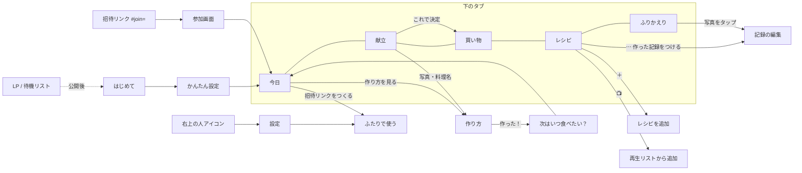

# リピごち 全体図（画面・データ・献立ロジック）

2026-09-24 時点。画面の文言とロジックを変えたら、この表も一緒に直す。

## 1. 約束

**「かぶらない、飽きない、また食べたい。」**

- かぶらない：最近と同じ系統（主食・主菜・味）を続けない
- 飽きない：同じ料理は「次に食べたい頃」までは出さない
- また食べたい：好きな料理は、ちょうどいい頃にまた出てくる。相手の「これ食べたい」を最優先

## 2. 画面の全体図

| 画面 | 見出し | いちばん大事な操作 | 表示するもの |
| --- | --- | --- | --- |
| 今日 | 今夜、これ食べたい。 | これにする／作り方を見る／作った！ | 💌リクエスト、最近のごはん、今夜の一品（理由つき）、明日以降、ふたりで使う案内 |
| 献立 | N日分、いい感じ。 | 入れ替え → これで決定・買い物へ | 日ごとの料理・時間・理由（リクエスト／かぶり回避／ちょうどいい頃） |
| 買い物 | 買ったら、ポン。 | 丸をタップで購入済み | あと◯つ、売り場ごとのカード、買い足す、購入済み・家にある |
| レシピ | おいしい、を集めよう。 | 🔖保存／🙋食べたい（リクエスト） | 写真一覧、検索、すべて・保存した・おすすめ |
| ふりかえり | 今月も、おいしかった。 | 写真をタップして記録を編集 | 月の切り替え、回数、今月の偏愛、わたしの食卓 |
| 作り方 | 料理名 | 作った！ | 材料・手順のチェック、安全の注意 |
| 次はいつ食べたい？ | 料理名、次はいつ食べたい？ | ひとりずつ周期を選ぶ | 家族の人数分の選択肢 |
| 記録の編集 | 料理名 | 記録を保存 | 食べた日、ひとりずつの周期、メモ、写真、削除 |
| 設定 | 食生活の設定 | ふたりで使う | 条件の変更、家族、バックアップ、合言葉（以前の方法） |
| 参加画面 | ◯◯から、ふたりの食卓への招待です。 | 参加する | 呼び名の入力 |

### 評価は1種類だけ（周期）

「作った！」のあと・記録の編集・どこでも同じ選択肢を使う。顔アイコンの3択は廃止した。

| 選択肢 | 意味 | 間隔 | 献立での扱い |
| --- | --- | --- | --- |
| 明日でも | 大好き | 1日 | 好きとして加点 |
| 毎週 | 好き | 7日 | 好きとして加点 |
| 月2回 | ほどよく | 14日 | |
| 月1回 | たまに | 30日 | |
| しばらくいい | お休み | 90日 | |
| もう作らない | | — | 候補から外す |

- まだ評価していない（作っただけ）料理は **14日** とみなす
- ふたりの周期がちがうときは **長いほう**（ふたりとも食べたくなる頃）に合わせる
- ふたりとも「明日でも／毎週」なら「ふたりとも好き」

## 3. 献立の決め方（`Lifestyle.propose`）

日ごとに、次の順で1品を選ぶ。

1. **確定済みの日はそのまま**（作った・確定・お休みは動かさない）
2. **自炊する曜日でなければお休み**
3. **候補をしぼる（必ず守る）**：夜ごはんであること、食べられない食材なし、「ない」器具を使わない、調理時間が条件内、誰かが「もう作らない」を選んでいない
4. **点数をつける**

   | 要素 | 点数 | 画面の理由 |
   | --- | --- | --- |
   | リクエスト（未完了） | +80 | 「むすめのリクエスト」 |
   | 次に食べたい頃を過ぎた | +20〜+35（久しいほど高い） | 「ちょうどいい頃（15日ぶり）」「久しぶり（30日ぶり）」 |
   | まだ早い | 最大 −60（早いほど低い） | |
   | 好き（明日でも・毎週）1人につき | +6 | 「ふたりとも好き」 |
   | 保存したレシピ | +5 | |
   | 条件との相性（好きな味・常備品・使い切り・重視すること） | 条件ごと | 「好きな味」「常備品2つを活用」など |
   | 直近3日と同じ主食 | −5×重み | 「一昨日はパスタだったので、ごはんものに」 |
   | 直近3日と同じ主菜（肉・魚・卵豆腐） | −3×重み | |
   | 直近3日と同じ味（和洋中） | −1×重み | |
   | 節約モード：同じ食材を使い回せる | +3／食材 | |

   重みは 昨日3・一昨日2・3日前1。「直近」には食べた記録と、この献立で先に決まった日の両方を含む。
5. **同じ献立に同じ料理は出さない**（候補が足りないときだけ再登場し「候補が少ないため」と表示）
6. **はじめての料理は1献立に1品まで**：それ以降は「リクエスト」か「次に食べたい頃を過ぎた料理」から選ぶ。どちらもなければ、はじめての料理でもよい
7. 入れ替えで選んだ料理（`planOverrides`）は、候補に残っていれば優先

**履歴**：「作った」記録、作った日の献立、確定したまま過ぎた日を、最長120日さかのぼって使う。

## 4. データ（何を共有するか）

| データ | 中身 | ふたりで共有 |
| --- | --- | --- |
| recipes | 保存したレシピ | ○ |
| evaluations | 食べた記録（日付・ひとりずつの周期・メモ・写真） | ○ |
| mealSlots | 日ごとの確定・作った・お休み | ○ |
| requests | 「これ食べたい」（誰から・状態：未完了／完了／パス／取り消し） | ○ |
| shoppingMarks / manualShopping | 買い物のチェック・買い足し | ○ |
| family / servingCount | 家族の呼び名・人数 | ○ |
| householdProfile | 器具・常備品 | ○ |
| foodProfile | 食べられない食材・好み・時間など個人の条件 | ×（端末ごと） |
| me | この端末を使う人 | ×（端末ごと） |

## 5. ふたりで使う・リクエスト

1. 1人目：今日の「招待リンクをつくる」または 設定 → ふたりで使う → 呼び名を2つ入れる → リンクをLINE等で送る
2. 2人目：リンクを開く → 参加画面で呼び名を確認 → 参加する（質問なしで今日の画面へ）
3. レシピ画面の「🙋 食べたい」でリクエスト。相手の端末では今日の「💌 リクエスト」に出て、献立の最優先になる
4. その料理を「作った」と記録すると、リクエストは自動で完了。「今回はパス」「取り消す」もできる

- 招待リンクの合言葉は端末が作る20文字のランダム文字列。URLの `#` 以降にあるのでサーバーのログに残らない
- 同期は変更の8秒後と、アプリを開き直したとき

## 6. 既知の制約・次の課題

- 2人目の端末の「提案（未確定）」は、その端末の条件で作られる。**確定した献立はふたりで同じ**。提案もそろえるには、献立の条件（時間・曜日・日数）を家庭の設定として共有する必要がある
- リクエストは相手がアプリを開いたときに届く（プッシュ通知はまだない）
- 食べられない食材は端末ごと。家庭全体の制限と個人の苦手を分ける（コンセプトの改善計画6）
- レシピ登録画面・設定画面は、まだ旧デザインの部分がある

## 7. 役割

| | 管理者 | 編集者 | 閲覧者 |
| --- | --- | --- | --- |
| 献立・買い物リストを見る | ○ | ○ | ○ |
| 🙋 食べたい・別のがいいを送る | ○ | ○ | ○ |
| 次に食べたい頃を答える | ○ | ○ | ○ |
| 買い物のチェック | ○ | ○ | ○ |
| 献立を決める・入れ替える | ○ | ○ | × |
| レシピの追加・編集 | ○ | ○ | × |
| 時間・器具などの条件 | ○ | ○ | × |
| 役割を変える | ○ | × | × |

- 招待リンクをつくった人が管理者、参加した人は閲覧者から始まる。設定「ふたりで使う → メンバーと役割」で切り替える
- 役割のない以前の家庭は、誰かの役割をえらんだ人が管理者になる

### 閲覧者の画面（食に興味がなくても1タップで済む）

- 参加直後の質問は2つだけ：「食べられないものはある？」（家庭の献立から除外）、「好きそうなのをタップ！」（その人の「毎週」とみなして加点）。人数・時間・器具は聞かない
- タブは 今日／献立／買い物／レシピ の4つ（ふりかえりは非表示）
- 今日：今夜の写真と料理名、明日の料理名、「🙋 食べたいものを送る」「献立を見る」だけ
- 献立：日付・写真・料理名と「🙋 変えたい」だけ。未決定なら「買い物の前に、🙋で送ってね」
- レシピ：写真・料理名・🙋 だけ（時間・保存・分類は非表示）
- 作ったあとの「次はいつ食べたい？」は6択すべて
