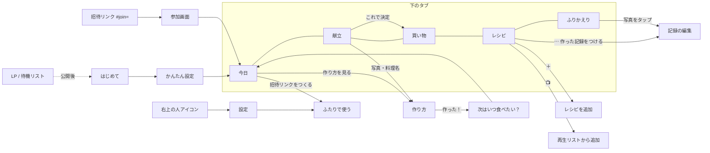

# リピごち 全体図（画面・データ・献立ロジック）

2026-09-24 時点。画面の文言とロジックを変えたら、この表も一緒に直す。

## 1. 約束

**「かぶらない、飽きない、また食べたい。」**

- かぶらない：最近と同じ系統（主食・主菜・味）を続けない
- 飽きない：同じ料理は「次に食べたい頃」までは出さない
- また食べたい：好きな料理は、ちょうどいい頃にまた出てくる。相手の「これ食べたい」を最優先

## 2. 画面の全体図

| 画面 | 見出し | いちばん大事な操作 | 表示するもの |
| --- | --- | --- | --- |
| 今日 | 今夜、これ食べたい。 | これにする／作り方を見る／作った！ | 💌リクエスト、最近のごはん、今夜の一品（理由つき）、明日以降、ふたりで使う案内 |
| 献立 | N日分、いい感じ。 | 入れ替え → これで決定・買い物へ | 日ごとの料理・時間・理由（リクエスト／かぶり回避／ちょうどいい頃） |
| 買い物 | （見出しなし・一覧優先） | 丸をタップで購入済み。全部そろうと「買い物完了にする？」 | 作る日の写真・あと◯つ・⋯メニュー（コピー／共有／売り場直し／常備品ページ／買い物完了）、縦書き売り場＋1行1品＋料理アイコン、買い足す、購入済み・家にある |
| レシピ | おいしい、を集めよう。 | 🔖保存／🙋食べたい（リクエスト） | 写真一覧、検索、すべて・保存した・おすすめ |
| ふりかえり | 今月も、おいしかった。 | 写真をタップして記録を編集 | 月の切り替え、回数、今月の偏愛、わたしの食卓 |
| 作り方 | 料理名 | 作った！ | 材料・手順のチェック、安全の注意 |
| 次はいつ食べたい？ | 料理名、次はいつ食べたい？ | ひとりずつ周期を選ぶ | 家族の人数分の選択肢 |
| 記録の編集 | 料理名 | 記録を保存 | 食べた日、ひとりずつの周期、メモ、写真、削除 |
| 設定 | 食生活の設定 | ふたりで使う | 条件の変更、家族、バックアップ、合言葉（以前の方法） |
| 参加画面 | ◯◯から、ふたりの食卓への招待です。 | 参加する | 呼び名の入力 |

### 評価は1種類だけ（周期）

「作った！」のあと・記録の編集・どこでも同じ選択肢を使う。顔アイコンの3択は廃止した。

| 選択肢 | 意味 | 間隔 | 献立での扱い |
| --- | --- | --- | --- |
| 明日でも | 大好き | 1日 | 好きとして加点 |
| 毎週 | 好き | 7日 | 好きとして加点 |
| 月2回 | ほどよく | 14日 | |
| 月1回 | たまに | 30日 | |
| しばらくいい | お休み | 90日 | |
| もう作らない | | — | 候補から外す |

- まだ評価していない（作っただけ）料理は **14日** とみなす
- ふたりの周期がちがうときは **長いほう**（ふたりとも食べたくなる頃）に合わせる
- ふたりとも「明日でも／毎週」なら「ふたりとも好き」

## 3. 献立の決め方（`Lifestyle.propose`）

日ごとに、次の順で1品を選ぶ。

1. **確定済みの日はそのまま**（作った・確定・お休みは動かさない）
2. **自炊する曜日でなければお休み**
3. **候補をしぼる（必ず守る）**：夜ごはんであること、食べられない食材なし、「ない」器具を使わない、調理時間が条件内、誰かが「もう作らない」を選んでいない
4. **点数をつける**

   | 要素 | 点数 | 画面の理由 |
   | --- | --- | --- |
   | リクエスト（未完了） | +80 | 「むすめのリクエスト」 |
   | 次に食べたい頃を過ぎた | +20〜+35（久しいほど高い） | 「ちょうどいい頃（15日ぶり）」「久しぶり（30日ぶり）」 |
   | まだ早い | 最大 −60（早いほど低い） | |
   | 好き（明日でも・毎週）1人につき | +6 | 「ふたりとも好き」 |
   | 保存したレシピ | +5 | |
   | 条件との相性（好きな味・常備品・使い切り・重視すること） | 条件ごと | 「好きな味」「常備品2つを活用」など |
   | 直近3日と同じ主食 | −5×重み | 「一昨日はパスタだったので、ごはんものに」 |
   | 直近3日と同じ主菜（肉・魚・卵豆腐） | −3×重み | |
   | 直近3日と同じ味（和洋中） | −1×重み | |
   | 節約モード：同じ食材を使い回せる | +3／食材 | |

   重みは 昨日3・一昨日2・3日前1。「直近」には食べた記録と、この献立で先に決まった日の両方を含む。
5. **同じ献立に同じ料理は出さない**（候補が足りないときだけ再登場し「候補が少ないため」と表示）
6. **はじめての料理は1献立に1品まで**：それ以降は「リクエスト」か「次に食べたい頃を過ぎた料理」から選ぶ。どちらもなければ、はじめての料理でもよい
7. 入れ替えで選んだ料理（`planOverrides`）は、候補に残っていれば優先

**履歴**：「作った」記録、作った日の献立、確定したまま過ぎた日を、最長120日さかのぼって使う。

## 4. データ（何を共有するか）

| データ | 中身 | ふたりで共有 |
| --- | --- | --- |
| recipes | 保存したレシピ | ○ |
| evaluations | 食べた記録（日付・ひとりずつの周期・メモ・写真） | ○ |
| mealSlots | 日ごとの確定・作った・お休み | ○ |
| requests | 「これ食べたい」（誰から・状態：未完了／完了／パス／取り消し） | ○ |
| shoppingMarks / manualShopping | 買い物のチェック・買い足し | ○ |
| family / servingCount | 家族の呼び名・人数 | ○ |
| householdProfile | 器具・常備品 | ○ |
| foodProfile | 食べられない食材・好み・時間など個人の条件 | ×（端末ごと） |
| me | この端末を使う人 | ×（端末ごと） |

## 5. ふたりで使う・リクエスト

1. 1人目：今日の「招待リンクをつくる」または 設定 → ふたりで使う → 呼び名を2つ入れる → リンクをLINE等で送る
2. 2人目：リンクを開く → 参加画面で呼び名を確認 → 参加する（質問なしで今日の画面へ）
3. レシピ画面の「🙋 食べたい」でリクエスト。相手の端末では今日の「💌 リクエスト」に出て、献立の最優先になる
4. その料理を「作った」と記録すると、リクエストは自動で完了。「今回はパス」「取り消す」もできる

- 招待リンクの合言葉は端末が作る20文字のランダム文字列。URLの `#` 以降にあるのでサーバーのログに残らない
- 同期は変更の8秒後と、アプリを開き直したとき

## 6. 既知の制約・次の課題

- 2人目の端末の「提案（未確定）」は、その端末の条件で作られる。**確定した献立はふたりで同じ**。提案もそろえるには、献立の条件（時間・曜日・日数）を家庭の設定として共有する必要がある
- リクエストは相手がアプリを開いたときに届く（プッシュ通知はまだない）
- 食べられない食材は端末ごと。家庭全体の制限と個人の苦手を分ける（コンセプトの改善計画6）
- レシピ登録画面・設定画面は、まだ旧デザインの部分がある

## 7. 役割

| | 管理者 | 編集者 | 閲覧者 |
| --- | --- | --- | --- |
| 献立・買い物リストを見る | ○ | ○ | ○ |
| 🙋 食べたい・別のがいいを送る | ○ | ○ | ○ |
| 次に食べたい頃を答える | ○ | ○ | ○ |
| 買い物のチェック | ○ | ○ | ○ |
| 献立を決める・入れ替える | ○ | ○ | × |
| レシピの追加・編集 | ○ | ○ | × |
| 時間・器具などの条件 | ○ | ○ | × |
| 役割を変える | ○ | × | × |

- 招待リンクをつくった人が管理者、参加した人は閲覧者から始まる。設定「ふたりで使う → メンバーと役割」で切り替える
- 役割のない以前の家庭は、誰かの役割をえらんだ人が管理者になる

### 閲覧者の画面（食に興味がなくても1タップで済む）

- 参加直後の質問は2つだけ：「食べられないものはある？」（家庭の献立から除外）、「好きそうなのをタップ！」（その人の「毎週」とみなして加点）。人数・時間・器具は聞かない
- タブは 今日／献立／買い物／レシピ の4つ（ふりかえりは非表示）
- 今日：今夜の写真と料理名、明日の料理名、「🙋 食べたいものを送る」「献立を見る」だけ
- 献立：日付・写真・料理名と「🙋 変えたい」だけ。未決定なら「買い物の前に、🙋で送ってね」
- レシピ：写真・料理名・🙋 だけ（時間・保存・分類は非表示）
- 作ったあとの「次はいつ食べたい？」は6択すべて

## 8. リクエストの流れ（買い物ラウンド）

| 段階 | 管理者・編集者 | 閲覧者 |
| --- | --- | --- |
| 受付前 | 献立タブ「リクエストを受け付ける」で買い物予定（日時）をえらぶ。初期値は前回と同じ曜日・時刻 | 🙋はいつでも送れる |
| 受付中（〜買い物予定） | 「もう一度知らせる」「コピー」「締切を変える」。届いたリクエストは各日のカードに出る | 「9/27（土）10:00に買い物！ それまでに🙋で送ってね（あと◯時間）」。🙋食べたい・🙋変えたい |
| 締切後 | 「延長する」。これで決定・買い物へ | 🙋変えたい は送れない。🙋食べたい は「食べたい気持ち」として記録（献立の未決定の日に反映される） |
| 買い物完了 | 買い物タブ「買い物完了」（全部そろうと強調） | 「今回の買い物は終わりました」 |

- 知らせるメッセージ：「◯/◯（曜）HH:MMに買い物に行く予定。献立変更のリクエストがあればそれまでによろしく！」＋献立タブへのリンク
- 連絡の各所（招待・受付・もう一度知らせる）に、LINE以外にも貼れる「コピー」ボタン
- リクエストは削除せず、状態（受付中・反映した・パス・取り消し、気持ち）とともに記録。今日の画面「これまでのリクエスト」で見られる

## 9. 共通タイムライン（今日・献立・買い物タブの上）

`献立 → リクエスト → 買い物 → 完了`（ひとりで使うときは リクエスト なし）。判定は `flowState()`：

| 段階 | 条件 | 管理者への一言 | 閲覧者への一言 |
| --- | --- | --- | --- |
| 献立 | 未決定の日があり、受付していない | 献立を見て、◯◯にリクエストを聞こう | 献立を準備中。食べたいものは🙋でいつでも |
| リクエスト | 未決定の日があり、受付中または締切後 | ◯/◯ HH:MM まで受付中（あと◯時間）／締切後は「献立を決めて買い物へ」 | ◯/◯ HH:MM までに🙋で送ってね／締切後は「決定を待っています」 |
| 買い物 | 献立が決定、買うものが残っている、買い物完了前 | あと◯品。終わったら「買い物完了」 | 買い物の準備中 |
| 完了 | 買い物完了、または買うものなし | あとは作って、食べて、「次はいつ食べたい？」 | 同じ |

## 10. 献立のリズムと週のボード

**リズム**（設定 → 献立のリズム。はじめは今日の画面で「これではじめる」）

| リズム | まとまり | 買い物（初期値） | お休み |
| --- | --- | --- | --- |
| 3日ずつ（おすすめ） | 月火水／木金土 | 各まとまりの前日 17:00（日・水） | 日曜 |
| 1週間まとめて | 月〜土 | 日 17:00 | 日曜 |
| 平日だけ | 月〜金 | 日 17:00 | 土日 |

- 買い物の時間は 10:00／12:00／17:00／19:00 から選ぶ。**リクエストの締切＝次のまとまりの買い物の日時**（毎回の受付操作は不要）
- 献立タブは「今のまとまり」と「次のまとまり」を表示し、まとまりごとに「◯〜◯をこれで決定」
- まとまりの状態：受付中 → 締切すぎ → 決定 → 買い物済み（買い物タブの「買い物完了」）
- リズムを選ばない家庭は、これまでどおり（3日／7日の切り替え＋手動の受付）

**週のボード**（今日・献立タブの上。閲覧者も同じ）

- 日曜はじまりの1週間。食べた日＝写真＋✓、決定＝写真、下書き＝薄い写真＋点線、お休み＝「休」、買い物の日＝🛒
- 下にまとまりの帯（受付中 〜水17:00／決定 ✓／買い物済み ✓）
- ‹ › で2週前〜来週まで（直近の食事の確認をかねる）
- 一言：「次の月〜水：9/27（日）17:00の買い物までに決めよう（リクエスト◯件）」、決定後は「9/26（土）まで決まってるよ」
- 買い物が終わったあとは、段階の表示ではなく「いつまで決まっているか」だけを出す

## 11. 定着の目安（LP・ゲーミフィケーションで使う想定）

- 3日ずつのリズムでは週2回の決定、週6回の夕食。評価が12〜18品たまると、「次に食べたい頃」を迎えた好物が献立に戻り始める
- 月2回（14日）・毎週（7日）の料理が最初に戻るのは **2〜3週目**。**4週目**には、下書きの多くが「好物のちょうどいい頃」とリクエストで埋まる想定
- そこで「**4週間で“また食べたい”が回り始める**」を目標にする。週のボード右上に「◯週目 ●●○○」を表示済み（最初の食事の記録から数える）
- 今後の案：4週達成のお祝い、LPで「まずは4週間」の打ち出し、週ごとのふりかえり（好物がいくつ戻ってきたか）

## 12. レシピの絞り込み（3タップ）

レシピ画面に3段のタグ。各段1つ選ぶ（もう一度タップで解除）。件数つきで、0件のタグは出さない。

| 段 | タグ |
| --- | --- |
| 主食 | ごはん・麺・パン・おかず |
| 素材 | 鶏・豚・牛・ひき肉・魚・卵・豆腐大豆・野菜が主役 |
| 気分・作り方 | 10分以内・レンジ・フライパン・鍋・ピリ辛・さっぱり・こってり・汁もの・和風・洋風・中華・エスニック |

タグは `Lifestyle.tags()` が料理名・材料・手順・器具・時間から自動で付ける（保存したレシピにも付く）。

- 追加の段：**わが家**（❤好き／久しぶり＝前回14日以上前／まだ作ってない／🙋リクエスト）を先頭、**投稿者**（保存したレシピに投稿者がいるときだけ）を最後に表示
- **投稿者の保存**：YouTubeはチャンネル名（URL取り込み・再生リスト）、TikTokは投稿者名を自動で保存。Instagramなど取れないものは登録画面「出典・タグ・本文を編集 → 投稿者・チャンネル」で入力。検索にも使われ、カードに「@投稿者」を表示
- URLから取り込んだレシピのタグは、保存時ではなく表示時に料理名・材料・手順から自動で付く（手入力不要。材料や手順を直すとタグも変わる）

## 13. 買い物の売り場（aisles.js）

- 並び：🥬野菜・果物 → 🍄きのこ → 🥩肉 → 🐟魚 → 🥚卵・豆腐・乳製品 → 🧊冷凍 → 🍚米・麺・パン → 🥫缶詰・乾物 → 🧂調味料 → 🛒その他
- 判定の順：①家庭の直し（買い物タブ「売り場がちがう品を直す」、ふたりで共有）→ ②材料名の辞書・語尾ルール（（）内の注記は外して判定。「チューブ」は調味料）→ ③レシピ側の分類 → ④その他
- 例：鶏ガラスープの素＝調味料、油揚げ＝卵・豆腐、ツナ缶＝缶詰、冷凍うどん＝冷凍

## 14. 買い物リストの範囲

- リストは「前回の買い物完了より後に確定した献立」だけから作る（`tripSlots()`）。前の買い物で買った食材や、その分量は新しいリストに混ざらない
- 先頭に「この買い物で作るごはん」：期間（例：9/25（金）〜9/27（日）の3食分）と料理の写真。タップで作り方へ
- 各品目に、使う料理名を小さく表示
- 買い物完了を押すと、その時点で決まっているまとまりすべてを「買い物済み」にする

## 15. レシピの詳細とおすすめレシピの表示

- レシピ一覧で写真・料理名をタップ → **レシピの詳細**（閲覧）：写真、時間・器具・投稿者、タグ、前回・ふたりの周期、材料（家庭の人数分）、作り方、メモ
  - 管理者・編集者：自分のレシピは「✏️ 編集する」（編集後は詳細に戻る）、作った記録、削除。おすすめは「🔖 自分のレシピに保存」
  - 閲覧者：見るだけ＋🙋食べたい
- **おすすめレシピ（最初から入っている料理）の ON/OFF**：設定「🍳 おすすめレシピ」。OFFでレシピ一覧・献立から除く（保存したものは残る）。家庭で共有
  - 自分の夜ごはんレシピが15品たまると、レシピ一覧に「おすすめを隠しますか？」を1回だけ出す

## 16. 今日タブ（再設計）

目的：**今夜なにを作るか迷わない**、作ったら「次はいつ食べたい？」に答える。今日タブはこれだけに絞る。

1. 日付・人数（1行）
2. 「次はいつ食べたい？」（作った直後だけ）
3. **今夜の一品**：写真・料理名・理由・時間。ボタンは状態に応じて1つ（これにする／作り方を見る／今夜は料理する）。決定済みなら「この料理の買うもの あと◯品」
4. **今日やること**（あるときだけ）：作った？（過去3日の未記録）、相手からのリクエスト、献立の締切が近い／過ぎた、買い物の日（買うものが残っている）、初回設定の続き
5. **明日は ○○ ›**（1行、献立タブへ）

献立タブへ移したもの：週のボード、献立のリズムの案内、ふたりで使う案内。やめたもの：最近のごはん、明日以降のカード2枚、今週のごちそう、再生リストの案内（レシピタブにある）。閲覧者の今日も週のボードを外した。

## 17. 料理のスキル（skills.js・内部DB）

| ★ | 段階 | 技法（id） |
| --- | --- | --- |
| 1 | はじめて | 混ぜる・和える（mix）／ちぎる・ほぐす・はさみ（hand）／レンジで加熱（microwave） |
| 2 | 慣れてきた | ゆでる・温める（boil）／包丁で切る（knife）／炒める（stirfry）／煮る（simmer）／ふたをして蒸す（steam）／卵に火を通す（egg） |
| 3 | ふつう | みじん切り（mince）／焼いて中まで火を通す（sear）／煮からめる・煮詰める（glaze）／切り開く・厚さをそろえる（butterfly） |
| 4 | 得意 | 揚げ焼き（shallowfry）／練る・成形・包む（shape）／乳化（emulsify） |
| 5 | 上級 | 揚げる（deepfry）／魚をおろす（fillet）／生地から作る（dough） |

- レシピの必要スキル＝**手順**から見つかった技法の最大の★。★3の技法が3つ以上重なる料理は＋1（同時進行が必要）。料理名は使わない（焼きうどん・包まない小籠包の誤判定を防ぐ）。「湯を切る・汁を切る」は包丁に数えない
- 初期38品：★1＝6品、★2＝21品、★3＝7品、★4＝4品（照り焼き・つくね・揚げ焼き・ハンバーグ）
- 表示：レシピの詳細に「★★★★☆ 得意」と主な技法。絞り込み「気分・作り方」に「かんたん★1〜2」
- 取り込んだレシピも手順から自動で判定。明らかな誤判定は `OVERRIDES` で個別に直せる
- 次の段階（未実装）：使う人のスキル（★）を設定し、献立で「★がそれより上の料理は出さない／週1回だけ挑戦の一皿」を選ぶ

## 18. 料理スキル診断と献立への反映

- **診断**（skill-quiz.js・1分）：9品を「作れる！／たぶん／むり…」で答える → ★1〜5とタイプ名
  - ★1 レンジ名人／★2 炒めもの上手／★3 フライパン使い／★4 おうちシェフ／★5 台所マイスター
  - 判定：★1から順に、その★の料理の平均が「たぶん」と「作れる」の中間（1.5）以上なら合格、はじめて不合格になった★の手前がランク
  - さいごに方針：「今のレパートリーで回したい（ルーティン）」／「少しずつレベルアップしたい」
- **入口**：`?skill=1`（誰でも開ける・集客用、オンボーディング前でも結果を保存）、今日の「今日やること」、設定「🔪 料理スキル」（方針の切り替え・再診断）。閲覧者には出さない
- **献立**：ランクより★が上の料理は出さない。「レベルアップ」なら★がひとつ上の料理を1献立に1品まで（直近6日に挑戦の料理があれば入れない）。理由に「ちょっと挑戦 ★★★」
- 結果は端末ごと（料理する人の端末）。シェア文：「料理スキル診断の結果は『フライパン使い』★★★☆☆でした。…」＋ `?skill=1` のリンク
- **LPの入口**：「あなたの料理スキルは？」カード（夜ごはんタイプ診断の下）→ `../?skill=1&from=lp`。LPから来た人の結果画面は「公開のお知らせを受け取る」（待機リストへ）を主ボタンにし、結果はその端末に保存

## 19. 初回のかんたん設定（5問・約1分）

1. 何人分つくる？（ひとり／ふたり）
2. 献立のリズム（3日ずつ＝おすすめ・既定／1週間／平日だけ）＋買い物の時間。選ぶと次へ進む
3. 料理はどのくらいする？（★1〜5のタイプから1タップ、または「わからない → 1分で診断する」）
4. 平日は何分くらい？
5. 食べられないもの（アレルギー11品＋自由記入）と**苦手なもの**（パクチー・ピーマン・なす・セロリ・しいたけ・トマト・納豆・レバー・さば・ゴーヤ＋自由記入）。どちらも献立から除く

→「🎉 最初の献立ができました！」（献立タブの上、次の操作まで表示）。ふたり分なら「相手を招待する／あとで」。閲覧者の参加フロー（2問）は変わらない

## 20. 最初のまとまり・好み診断の結果・設定の一覧

- **最初のまとまり**：リズムを選んだとき、今日以降に決定済みの献立がなければ、「買い物の時間がまだ先にある最初のまとまり」から始める（`rhythm.startFrom`）。それより前の日は献立を作らず、今日タブは「献立は9/28（月）から／最初の買い物は9/27（日）17:00。それまでは、いつもどおりで大丈夫！」、週のボードは「–」
- **ごはんの好み診断**（旧「今夜のときめき診断」）：「今」の言葉をやめ、ふだんの好みとして聞く。結果はキャラクター・名前・ひとこと＋**3つの特徴**（例：😋 見た目より、味が決め手／💰 節約じょうず。あるものでやりくり／⚡ 早く食べたい！ 時短が正義）＋好きそうな料理（選んだ写真）。シェア画像も同じ構成で「あなたは何タイプ？ 1分でわかる」
- **設定**：項目ごとに1行（アイコン・名前・今の設定）を並べ、タップした1つだけ開く
