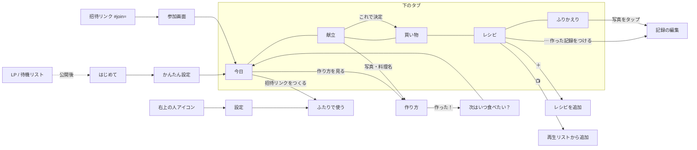

# リピごち 全体図（画面・データ・献立ロジック）

2026-09-24 時点。画面の文言とロジックを変えたら、この表も一緒に直す。

## 1. 約束

**「かぶらない、飽きない、また食べたい。」**

- かぶらない：最近と同じ系統（主食・主菜・味）を続けない
- 飽きない：同じ料理は「次に食べたい頃」までは出さない
- また食べたい：好きな料理は、ちょうどいい頃にまた出てくる。相手の「これ食べたい」を最優先

## 2. 画面の全体図

```mermaid
flowchart LR
  LP[LP / 待機リスト] -.公開後.-> Start
  Invite[招待リンク #join=] --> Join[参加画面]
  Start[はじめて] --> Setup[かんたん設定]
  Setup --> Today
  Join --> Today
  subgraph Tabs[下のタブ]
    Today[今日] --- Plan[献立] --- Shop[買い物] --- Recipes[レシピ] --- Refl[ふりかえり]
  end
  Today -->|作り方を見る| Cook[作り方]
  Plan -->|写真・料理名| Cook
  Cook -->|作った！| Rate[次はいつ食べたい？]
  Rate --> Today
  Plan -->|これで決定| Shop
  Recipes -->|＋| Register[レシピを追加]
  Recipes -->|📺| Playlist[再生リストから追加]
  Recipes -->|⋯ 作った記録をつける| Record[記録の編集]
  Refl -->|写真をタップ| Record
  Profile[右上の人アイコン] --> Settings[設定]
  Settings --> Share[ふたりで使う]
  Today -->|招待リンクをつくる| Share
```

| 画面 | 見出し | いちばん大事な操作 | 表示するもの |
| --- | --- | --- | --- |
| 今日 | 今夜、これ食べたい。 | これにする／作り方を見る／作った！ | 💌リクエスト、最近のごはん、今夜の一品（理由つき）、明日以降、ふたりで使う案内 |
| 献立 | 献立（上部バー） | 入れ替え → これで決定・買い物へ | 日ごとの料理・時間・理由（リクエスト／かぶり回避／ちょうどいい頃） |
| 買い物 | （見出しなし・一覧優先） | 丸をタップで購入済み。全部そろうと「買い物完了にする？」 | 作る日の写真・あと◯つ・⋯メニュー（コピー／共有／売り場直し／常備品ページ／買い物完了）、縦書き売り場＋1行1品＋料理アイコン、買い足す、購入済み・家にある |
| レシピ | レシピ（上部バー・＋） | 🔖保存／🙋食べたい（リクエスト） | 写真一覧、検索、すべて・保存した・おすすめ |
| ふりかえり | ふりかえり（上部バー・月切替） | 写真をタップして記録を編集 | 月の切り替え、回数、💡わかってきたこと（今月のみ）、今月の偏愛、わたしの食卓 |
| 作り方 | 料理名 | 作った！ | 材料・手順のチェック、安全の注意 |
| 次はいつ食べたい？ | 料理名、次はいつ食べたい？ | ひとりずつ周期を選ぶ | 家族の人数分の選択肢 |
| 記録の編集 | 料理名 | 記録を保存 | 食べた日、ひとりずつの周期、メモ、写真、削除 |
| 設定 | 食生活の設定 | ふたりで使う | 条件の変更、家族、バックアップ、合言葉（以前の方法） |
| 参加画面 | ◯◯から、ふたりの食卓への招待です。 | 参加する | 呼び名の入力 |

### 評価は1種類だけ（周期）

「作った！」のあと・記録の編集・どこでも同じ選択肢を使う。顔アイコンの3択は廃止した。

| 選択肢 | 意味 | 間隔 | 献立での扱い |
| --- | --- | --- | --- |
| 明日でも | 大好き | 1日 | 好きとして加点 |
| 毎週 | 好き | 7日 | 好きとして加点 |
| 月2回 | ほどよく | 14日 | |
| 月1回 | たまに | 30日 | |
| しばらくいい | お休み | 90日 | |
| もう作らない | | — | 候補から外す |

- まだ評価していない（作っただけ）料理は **14日** とみなす
- ふたりの周期がちがうときは **長いほう**（ふたりとも食べたくなる頃）に合わせる
- ふたりとも「明日でも／毎週」なら「ふたりの好物・8日ぶり」（3人以上は「みんなの好物」、1人だけなら「パパの好物・15日ぶり」、ひとり暮らしは「大好物・9日ぶり」）

## 3. 献立の決め方（`Lifestyle.propose`）

日ごとに、次の順で1品を選ぶ。

1. **確定済みの日はそのまま**（作った・確定・お休みは動かさない）
2. **自炊する曜日でなければお休み**
3. **候補をしぼる（必ず守る）**：夜ごはんであること、食べられない食材なし、「ない」器具を使わない、調理時間が条件内、誰かが「もう作らない」を選んでいない
4. **点数をつける**

   | 要素 | 点数 | 画面の理由 |
   | --- | --- | --- |
   | リクエスト（未完了） | +80 | 「むすめのリクエスト」 |
   | 次に食べたい頃を過ぎた | +20〜+35（久しいほど高い） | 好物の人がいれば上の「〜の好物・N日ぶり」、いなければ「ちょうどいい頃（15日ぶり）」「久しぶり（30日ぶり）」 |
   | まだ早い | 最大 −60（早いほど低い） | |
   | 好き（明日でも・毎週）1人につき | +6 | （まだ作っていなければ）「ふたりの好物」 |
   | 保存したレシピ | +5 | |
   | 条件との相性（好きな味・常備品・使い切り・重視すること） | 条件ごと | 「好きな味」「常備品2つを活用」など |
   | 直近3日と同じ主食 | −5×重み | 「一昨日はパスタ → ごはんもの」 |
   | 直近3日と同じ主菜（肉・魚・卵豆腐） | −3×重み | 主食の理由がないとき、直近2日が肉か魚なら「昨日は魚 → 肉」「肉続き → 魚」 |
   | 直近3日と同じ味（和洋中） | −1×重み | |
   | 節約モード：同じ食材を使い回せる | +3／食材 | |
   | 日持ち（買い物から何日目か） | 急ぎ度×（0日目 +1.5／1日目 +0.5／2日目 −0.5／3日目 −1.5、以後1日ごとに −0.5、下限 −3） | 「もやし・豆苗は日持ちしないので早めに」（急ぎ度3以上を0〜1日目に置いた時） |

   | 旬の食材（月ごと。冷凍・缶・乾物は除く） | +2 | 「🍂 旬の鮭」（🌸3〜5月・🌻6〜8月・🍂9〜11月・⛄12〜2月） |

   カードに出す理由は1つだけ（約12文字で切れない長さ）。優先順：リクエスト → ちょっと挑戦 → 好物・周期 → 主食・主菜のかぶり → 旬。確定済みの日も、好物・周期と旬を出す。

   重みは 昨日3・一昨日2・3日前1。「直近」には食べた記録と、この献立で先に決まった日の両方を含む。
5. **同じ献立に同じ料理は出さない**（候補が足りないときだけ再登場し「候補が少ないため」と表示）
6. **はじめての料理は1献立に1品まで**：それ以降は「リクエスト」か「次に食べたい頃を過ぎた料理」から選ぶ。どちらもなければ、はじめての料理でもよい
7. 入れ替えで選んだ料理（`planOverrides`）は、候補に残っていれば優先

**日持ちの急ぎ度**（`Lifestyle.freshness`）：材料のうち、いちばん傷みやすく冷凍しにくいもの。刺身・もやし/豆苗 5、葉もの野菜・魚介 4、ひき肉・豆腐 3、鶏肉・夏野菜/ブロッコリー 2、豚牛・きのこ・乳製品 1。冷凍品・缶詰・乾物・ハム/ベーコン/練り物は0。「何日目か」は献立のリズムのまとまり（1回の買い物で作る日）の中の位置。リズムがなければ今日から。

**作れない日の逃げ道**（plan-moves.js）：今日の「🍽 今日は外食・中食にする」、献立の「⋯」から。外食／テイクアウト・惣菜／デリバリー／あるもので を選ぶと、その日はお休み（種類つき）。
- 「次に作る日へずらす」（既定でオン）：その日の確定した料理（買った材料）か、日付を指定した料理を次に作る日へ。そこに決まった料理があれば、それも1日ずつ後ろへ（お休み・作った日・自炊しない曜日はとばす）。はみ出した料理は、まとまりの次の日に入る
- 買い物のあとに動かした料理は `bought` の印を持ち、買い物リストに戻らない。動かした日には「9/27からずらしました」
- **まとまりからはみ出す時**（例：平日5日で火曜に外食→金曜の分があふれる）：選ぶ画面で3つから選ぶ。①「1日ずつ後ろにずらして、土曜日も料理する（おすすめ・既定）」＝あふれた料理を、いちばん近いお休みの曜日に作る（確定した料理だけ）②「次の自炊日まで持ち越す」＝翌週の月曜へ。傷みやすい食材なら冷凍をすすめる ③「ずらさない」。②の場合：翌週の献立は、持ち越した料理（確定・購入済み）から始まり、残りの日を新しく決める。持ち越した料理の材料は、翌週の買い物リストに入らない。翌週のカードには「↪ 10月2日の分を持ち越し」、傷みやすい食材を買ってから4日以上なら「🧊 もやしは買ってから8日。冷凍しておくと安心」
- 買い物の前に外食にした時は、ずらした料理も今回の買い物リストに入ったまま（今回まとめて買う）
- 初回設定で選んだ「いつものお店」を、選ぶ画面にそっと出す
- **入れ替え**：「⋯」の「↑ 前の日と／↓ 次の日と入れ替え」。となりの料理する日と料理を入れかえる（確定した料理は確定のまま）。時間などの条件に合わない時はひとこと知らせる

**履歴**：「作った」記録、作った日の献立、確定したまま過ぎた日を、最長120日さかのぼって使う。

## 4. データ（何を共有するか）

| データ | 中身 | ふたりで共有 |
| --- | --- | --- |
| recipes | 保存したレシピ | ○ |
| evaluations | 食べた記録（日付・ひとりずつの周期・メモ・写真） | ○ |
| mealSlots | 日ごとの確定・作った・お休み | ○ |
| requests | 「これ食べたい」（誰から・状態：未完了／完了／パス／取り消し） | ○ |
| shoppingMarks / manualShopping | 買い物のチェック・買い足し | ○ |
| family / servingCount | 家族の呼び名・人数 | ○ |
| householdProfile | 器具・常備品 | ○ |
| foodProfile | 食べられない食材・好み・時間など個人の条件 | ×（端末ごと） |
| tasteProfile | わが家のごはん方針：人ごとの答え・解釈の確認（合ってる／違う）・方針の版（§37） | ×（端末ごと。バックアップには入る） |
| me | この端末を使う人 | ×（端末ごと） |

## 5. ふたりで使う・リクエスト

1. 1人目：今日の「招待リンクをつくる」または 設定 → ふたりで使う → 呼び名を2つ入れる → リンクをLINE等で送る
2. 2人目：リンクを開く → 参加画面で呼び名を確認 → 参加する（質問なしで今日の画面へ）
3. レシピ画面の「🙋 食べたい」でリクエスト。相手の端末では今日の「💌 リクエスト」に出て、献立の最優先になる
4. その料理を「作った」と記録すると、リクエストは自動で完了。「今回はパス」「取り消す」もできる

- 招待リンクの合言葉は端末が作る20文字のランダム文字列。URLの `#` 以降にあるのでサーバーのログに残らない
- 同期は変更の8秒後と、アプリを開き直したとき

## 6. 既知の制約・次の課題

- 2人目の端末の「提案（未確定）」は、その端末の条件で作られる。**確定した献立はふたりで同じ**。提案もそろえるには、献立の条件（時間・曜日・日数）を家庭の設定として共有する必要がある
- リクエストは相手がアプリを開いたときに届く（プッシュ通知はまだない）
- 食べられない食材は端末ごと。家庭全体の制限と個人の苦手を分ける（コンセプトの改善計画6）
- レシピ登録画面・設定画面は、まだ旧デザインの部分がある

## 7. 役割

| | 管理者 | 編集者 | 閲覧者 |
| --- | --- | --- | --- |
| 献立・買い物リストを見る | ○ | ○ | ○ |
| 🙋 食べたい・別のがいいを送る | ○ | ○ | ○ |
| 次に食べたい頃を答える | ○ | ○ | ○ |
| 買い物のチェック | ○ | ○ | ○ |
| 献立を決める・入れ替える | ○ | ○ | × |
| レシピの追加・編集 | ○ | ○ | × |
| 時間・器具などの条件 | ○ | ○ | × |
| 役割を変える | ○ | × | × |

- 招待リンクをつくった人が管理者、参加した人は閲覧者から始まる。設定「ふたりで使う → メンバーと役割」で切り替える
- 役割のない以前の家庭は、誰かの役割をえらんだ人が管理者になる

### 閲覧者の画面（食に興味がなくても1タップで済む）

- 参加直後の質問は2つだけ：「食べられないものはある？」（家庭の献立から除外）、「好きそうなのをタップ！」（その人の「毎週」とみなして加点）。人数・時間・器具は聞かない
- タブは 今日／献立／買い物／レシピ の4つ（ふりかえりは非表示）
- 今日：今夜の写真と料理名、明日の料理名、「🙋 食べたいものを送る」「献立を見る」だけ
- 献立：日付・写真・料理名と「🙋 変えたい」だけ。未決定なら「買い物の前に、🙋で送ってね」
- レシピ：写真・料理名・🙋 だけ（時間・保存・分類は非表示）
- 作ったあとの「次はいつ食べたい？」は6択すべて

## 8. リクエストの流れ（買い物ラウンド）

| 段階 | 管理者・編集者 | 閲覧者 |
| --- | --- | --- |
| 受付前 | 献立タブ「リクエストを受け付ける」で買い物予定（日時）をえらぶ。初期値は前回と同じ曜日・時刻 | 🙋はいつでも送れる |
| 受付中（〜買い物予定） | 「もう一度知らせる」「コピー」「締切を変える」。届いたリクエストは各日のカードに出る | 「9/27（土）10:00に買い物！ それまでに🙋で送ってね（あと◯時間）」。🙋食べたい・🙋変えたい |
| 締切後 | 「延長する」。これで決定・買い物へ | 🙋変えたい は送れない。🙋食べたい は「食べたい気持ち」として記録（献立の未決定の日に反映される） |
| 買い物完了 | 買い物タブ「買い物完了」（全部そろうと強調） | 「今回の買い物は終わりました」 |

- 知らせるメッセージ：「◯/◯（曜）HH:MMに買い物に行く予定。献立変更のリクエストがあればそれまでによろしく！」＋献立タブへのリンク
- 連絡の各所（招待・受付・もう一度知らせる）に、LINE以外にも貼れる「コピー」ボタン
- リクエストは削除せず、状態（受付中・反映した・パス・取り消し、気持ち）とともに記録。今日の画面「これまでのリクエスト」で見られる

## 9. 共通タイムライン（今日・献立・買い物タブの上）

`献立 → リクエスト → 買い物 → 完了`（ひとりで使うときは リクエスト なし）。判定は `flowState()`：

| 段階 | 条件 | 管理者への一言 | 閲覧者への一言 |
| --- | --- | --- | --- |
| 献立 | 未決定の日があり、受付していない | 献立を見て、◯◯にリクエストを聞こう | 献立を準備中。食べたいものは🙋でいつでも |
| リクエスト | 未決定の日があり、受付中または締切後 | ◯/◯ HH:MM まで受付中（あと◯時間）／締切後は「献立を決めて買い物へ」 | ◯/◯ HH:MM までに🙋で送ってね／締切後は「決定を待っています」 |
| 買い物 | 献立が決定、買うものが残っている、買い物完了前 | あと◯品。終わったら「買い物完了」 | 買い物の準備中 |
| 完了 | 買い物完了、または買うものなし | あとは作って、食べて、「次はいつ食べたい？」 | 同じ |

## 10. 献立のリズムと週のボード

**リズム**（設定 → 献立のリズム。はじめは今日の画面で「これではじめる」）

| リズム（`preset`） | まとまり（初期値） | 買い物（初期値） | お休み（初期値） |
| --- | --- | --- | --- |
| 5日（`weekday`・おすすめ） | 月〜金 | 日 17:00（週1回） | 土日 |
| 3日＋3日（`3day`） | 月火水／木金土 | 各まとまりの前日 17:00（日・水、週2回） | 日曜 |
| 3日（`three`） | 月火水 | 日 17:00（週1回） | 木〜日 |
| 1週間まとめて（`week`） | 月〜土 | 日 17:00 | 日曜 |

- **週の始まり・作る曜日を選べる**（PR 5a・`docs/PERSONALIZE_PLAN.md` §9。月曜固定にしない）：設定の「献立のリズム」で、週の始まりの曜日を選ぶと、作る曜日はそこから続けてリズムの日数。作る曜日は1つずつ外す・足すこともでき（飛び飛びでもよい）、日数がそろった時だけ保存する（「あと1日」と出す）。3日＋3日は、週の始まりからの順に前の3日／後ろの3日に分ける（例：土日月／火水木。週をまたいでよい）。`state.rhythm.days`（週の始まりからの順の曜日、0＝日）と `state.rhythm.start`（週の始まり。作る曜日を外したり戻したりしても動かない）。日数が合わない・同じ曜日・数字でない値（`null`・空文字・"1" なども曜日にしない）・週の始まりから1週間の中で前に進まない並び（例：[3, 2, 1]）は使わず、以前からの月曜はじまりに戻す
- **買い物の日**：まとまりの前日（ふつう）か初日（`state.rhythm.shopBefore: 0`）。決める日の通知（カレンダーのくり返し）も買い物の日に合わせる
- **今までの人**：`days` のないリズムは、以前と同じ月曜はじまりのまとまりのまま（保存・同期の形も変わらない）

- 買い物の時間は 10:00／12:00／17:00／19:00 から選ぶ。**リクエストの締切＝次のまとまりの買い物の日時**（毎回の受付操作は不要）
- 献立タブは「今のまとまり」と「次のまとまり」を表示し、まとまりごとに「◯〜◯をこれで決定」
- まとまりの状態：受付中 → 締切すぎ → 決定 → 買い物済み（買い物タブの「買い物完了」）
- リズムを選ばない家庭は、これまでどおり（3日／7日の切り替え＋手動の受付）

**週のボード**（今日・献立タブの上。閲覧者も同じ）

- 日曜はじまりの1週間。食べた日＝写真＋✓、決定＝写真、下書き＝薄い写真＋点線、お休み＝「休」、買い物の日＝🛒
- 下にまとまりの帯（受付中 〜水17:00／決定 ✓／買い物済み ✓）
- ‹ › で2週前〜来週まで（直近の食事の確認をかねる）
- 一言：「次の月〜水：9/27（日）17:00の買い物までに決めよう（リクエスト◯件）」、決定後は「9/26（土）まで決まってるよ」
- 買い物が終わったあとは、段階の表示ではなく「いつまで決まっているか」だけを出す

## 11. 定着の目安（LP・ゲーミフィケーションで使う想定）

- 3日ずつのリズムでは週2回の決定、週6回の夕食。評価が12〜18品たまると、「次に食べたい頃」を迎えた好物が献立に戻り始める
- 月2回（14日）・毎週（7日）の料理が最初に戻るのは **2〜3週目**。**4週目**には、下書きの多くが「好物のちょうどいい頃」とリクエストで埋まる想定
- そこで「**4週間で“また食べたい”が回り始める**」を目標にする。週のボード右上に「◯週目 ●●○○」を表示済み（最初の食事の記録から数える）
- 今後の案：4週達成のお祝い、LPで「まずは4週間」の打ち出し、週ごとのふりかえり（好物がいくつ戻ってきたか）

## 12. レシピの絞り込み（3タップ）

レシピ画面に3段のタグ。各段1つ選ぶ（もう一度タップで解除）。件数つきで、0件のタグは出さない。

| 段 | タグ |
| --- | --- |
| 主食 | ごはん・麺・パン・おかず |
| 素材 | 鶏・豚・牛・ひき肉・魚・卵・豆腐大豆・野菜が主役 |
| 気分・作り方 | 10分以内・レンジ・フライパン・鍋・ピリ辛・さっぱり・こってり・汁もの・和風・洋風・中華・エスニック |

タグは `Lifestyle.tags()` が料理名・材料・手順・器具・時間から自動で付ける（保存したレシピにも付く）。

- 追加の段：**わが家**（❤好き／久しぶり＝前回14日以上前／まだ作ってない／🙋リクエスト）を先頭、**投稿者**（保存したレシピに投稿者がいるときだけ）を最後に表示
- **投稿者の保存**：YouTubeはチャンネル名（URL取り込み・再生リスト）、TikTokは投稿者名を自動で保存。Instagramなど取れないものは登録画面「出典・タグ・本文を編集 → 投稿者・チャンネル」で入力。検索にも使われ、カードに「@投稿者」を表示
- URLから取り込んだレシピのタグは、保存時ではなく表示時に料理名・材料・手順から自動で付く（手入力不要。材料や手順を直すとタグも変わる）

## 13. 買い物の売り場（aisles.js）

- 並び：🥬野菜・果物 → 🍄きのこ → 🥩肉 → 🐟魚 → 🥚卵・豆腐・乳製品 → 🧊冷凍 → 🍚米・麺・パン → 🥫缶詰・乾物 → 🧂調味料 → 🛒その他
- 判定の順：①家庭の直し（買い物タブ「売り場がちがう品を直す」、ふたりで共有）→ ②材料名の辞書・語尾ルール（（）内の注記は外して判定。「チューブ」は調味料）→ ③レシピ側の分類 → ④その他
- 例：鶏ガラスープの素＝調味料、油揚げ＝卵・豆腐、ツナ缶＝缶詰、冷凍うどん＝冷凍

## 14. 買い物リストの範囲

- リストは「前回の買い物完了より後に確定した献立」だけから作る（`tripSlots()`）。前の買い物で買った食材や、その分量は新しいリストに混ざらない
- 先頭に「この買い物で作るごはん」：期間（例：9/25（金）〜9/27（日）の3食分）と料理の写真。タップで作り方へ
- 各品目に、使う料理名を小さく表示
- 買い物完了を押すと、その時点で決まっているまとまりすべてを「買い物済み」にする
- **献立を変えた時の差分を品名で**（PR 5b・`changedShopping`）：買い物タブの上に「＋ 買う物に増えた／− いらなくなった／↻ 分量・使う料理が変わった（買ってある分で足りるか確認）／🧺 もう買ってあるのに、使わなくなった」。×で閉じる（端末の中だけ・次に献立を変えるまで）。変えた時にも短い知らせ。「🧺 もう買ってある…」は「残っている食材に入れる」で下の残りの食材へ
- **🧺 家に残っている食材**（PR 5b・献立タブ、前に買い物完了をしたことがある時）：候補は「ここ7日で買った印があるのに、今のリストで使わなくなった品」と「前の買い物のあとに予定していたのに、作らずに過ぎた料理の材料」（水などは出さない）。**候補は候補のまま、本人が押した物だけを使う**（使ったはずと決めつけない）。ほかの物も入力で足せる。選んでから7日で外れる。`state.leftovers = { items: { 名前: { at } }, updatedAt }`（家族の同期に入る。まるごと新しいほう）
- 残っている食材は、献立の点数で「使い切りたい食材」と同じ＋20（両方でも1回）、理由は「🧺 残りの◯◯を使う」。**「🧺 この食材で組み直す」は、まだ決めていない日だけを作り直す**（確定・作った・お休みの日は置き換えない）。買い物リストからは勝手に外さず（量が分からない）、「🧺 残りあり」と出す
- **傷みやすい食材は「その前に買うと安心」**（PR 5c・`freshLater`。§9「保存できる日数を推測で保証しない」）：まとめ買いのリストで、傷みやすい食材（`Lifestyle.freshness` の急ぎ度）を、買い物の日から何日も後に初めて使う時だけ、その品の下に「🗓 10月4日（日）に使う・傷みやすいので、その前に買うと安心」。急ぎ度5（刺身・もやし）は2日目から、4（葉もの・魚介）は3日目から、3（ひき肉・豆腐）は4日目から。冷凍品・缶詰などは出さない。**何日もつとは書かない**。買い物の日は、リズムのまとまりの買い物の日（過ぎていれば今日）、リズムがなければ今日
- **「あとで」**（本人が押す）：その品を今回の買い物から外し（買った印 `later`。「家にある」ではない）、「もやし（10月4日の分）」として買い足すものに入れる（手入力の品なので、買い物完了の後も残る）。「あとで買う」の欄にまとめる。元に戻せる。買い物完了は「あとで」の品を待たない。古い版のアプリは `later` を知らないので「買う」に戻す（買い忘れない側）
- **人数を変えた時**：買った印は残し、量が変わった品は「要確認」（買った量で足りるか確かめる。以前から）

## 15. レシピの詳細とおすすめレシピの表示

- レシピ一覧で写真・料理名をタップ → **レシピの詳細**（閲覧）：写真、時間・器具・投稿者、タグ、前回・ふたりの周期、材料（家庭の人数分）、作り方、メモ
  - 管理者・編集者：自分のレシピは「✏️ 編集する」（編集後は詳細に戻る）、作った記録、削除。おすすめは「🔖 自分のレシピに保存」
  - 閲覧者：見るだけ＋🙋食べたい
- **おすすめレシピ（最初から入っている料理）の ON/OFF**：設定「🍳 おすすめレシピ」。OFFでレシピ一覧・献立から除く（保存したものは残る）。家庭で共有
  - 自分の夜ごはんレシピが15品たまると、レシピ一覧に「おすすめを隠しますか？」を1回だけ出す

## 16. 今日タブ（再設計）

目的：**今夜なにを作るか迷わない**、作ったら「次はいつ食べたい？」に答える。今日タブはこれだけに絞る。

1. 日付・人数（1行）
2. 「次はいつ食べたい？」（作った直後だけ）
3. **今夜の一品**：写真・料理名・理由・時間。ボタンは状態に応じて1つ（これにする／作り方を見る／今夜は料理する）。決定済みなら「この料理の買うもの あと◯品」
4. **今日やること**（あるときだけ）：作った？（過去3日の未記録）、相手からのリクエスト、献立の締切が近い／過ぎた、買い物の日（買うものが残っている）、初回設定の続き
5. **明日は ○○ ›**（1行、献立タブへ）

献立タブへ移したもの：週のボード、献立のリズムの案内、ふたりで使う案内。やめたもの：最近のごはん、明日以降のカード2枚、今週のごちそう、再生リストの案内（レシピタブにある）。閲覧者の今日も週のボードを外した。

## 17. 料理のスキル（skills.js・内部DB）

| ★ | 段階 | 技法（id） |
| --- | --- | --- |
| 1 | はじめて | 混ぜる・和える（mix）／ちぎる・ほぐす・はさみ（hand）／レンジで加熱（microwave） |
| 2 | 慣れてきた | ゆでる・温める（boil）／包丁で切る（knife）／炒める（stirfry）／煮る（simmer）／ふたをして蒸す（steam）／卵に火を通す（egg） |
| 3 | ふつう | みじん切り（mince）／焼いて中まで火を通す（sear）／煮からめる・煮詰める（glaze）／切り開く・厚さをそろえる（butterfly） |
| 4 | 得意 | 揚げ焼き（shallowfry）／練る・成形・包む（shape）／乳化（emulsify） |
| 5 | 上級 | 揚げる（deepfry）／魚をおろす（fillet）／生地から作る（dough） |

- レシピの必要スキル＝**手順**から見つかった技法の最大の★。★3の技法が3つ以上重なる料理は＋1（同時進行が必要）。料理名は使わない（焼きうどん・包まない小籠包の誤判定を防ぐ）。「湯を切る・汁を切る」は包丁に数えない
- 初期38品：★1＝6品、★2＝21品、★3＝7品、★4＝4品（照り焼き・つくね・揚げ焼き・ハンバーグ）
- 表示：レシピの詳細に「★★★★☆ 得意」と主な技法。絞り込み「気分・作り方」に「かんたん★1〜2」
- 取り込んだレシピも手順から自動で判定。明らかな誤判定は `OVERRIDES` で個別に直せる
- 次の段階（未実装）：使う人のスキル（★）を設定し、献立で「★がそれより上の料理は出さない／週1回だけ挑戦の一皿」を選ぶ

## 18. 料理スキル試験・経験値・バッジと献立への反映

- **試験**（skill-quiz.js・CBT方式・10問）：知識を問う4択（計量・衛生・安全・下ごしらえ・火加減・味つけ・段取り・揚げ物、難しさ★1〜5の約55問）。1問ごとに正解と解説
  - 出題：推定の力（θ、はじめ3）にいちばん近い難しさから、まだ出ていない分野を優先。正解で上・不正解で下へ（動く幅は1から毎回0.75倍、下限0.25）
  - 結果：スコア＝(θ−0.5)/5×1000（0〜1000点）。★は帯で決める（★1 0〜239／★2 240〜／★3 440〜／★4 640〜／★5 840〜）。階級は100点ごとに10級→1級、950点以上は初段
  - 結果画面：スコア・階級・★とタイプ名・分野ごとの正解数・階級のしくみ（★ごとのスコアの帯と身につくスキル）・次の★まで（あと約◯皿・約◯週）→ さいごに方針（レベルアップ／今のレパートリー）を選んで保存
  - ★1 レンジ名人／★2 炒めもの上手／★3 フライパン使い／★4 おうちシェフ／★5 台所マイスター
  - 写真のAI判定（★）もあれば、試験の★と平均して切り上げたものが料理スキル
- **経験値**（cook-level.js）：作った記録（state.evaluations）から毎回計算（保存しないので家族の端末でも同じ）。1皿10XP＋料理の★ひとつごとに5XP＋はじめての料理10XP＋写真5XP＋前の日も作った5XP。1日2皿まで。Lv n→n+1 に 40+20(n−1) XP
  - 「作った！」のあと、画面上に「+◯XP」「Lvアップ」「新しいバッジ」「昇級試験が受けられます」を小さく出す
- **昇級試験**：★2はLv2、★3はLv4、★4はLv7、★5はLv11から。ひとつ上の★の問題を5問、4問正解で合格（★が上がる）。不合格の日は次の日から。今日の「今日やること」と設定に出る
- **バッジ**（15個）：はじめの一皿・腕試し・写真デビュー・3日連続・1週間達成（7日のうち5日）・10皿・定番誕生（同じ料理3回）・レパートリー10・7日連続・成形デビュー・揚げ物デビュー・昇級・1週間コンプ（§24）・30皿・100皿。まだのバッジは条件を表示
- **設定「🔪 料理スキル・バッジ」**：Lv・XPバー・★・階級とスコア・次の★まで（または昇級試験ボタン）・身についたスキル（作った料理の手順から、回数つき。次に覚えるスキルは点線）・バッジ棚・診断の写真・方針の切り替え・試験の受け直し
- **写真をイラストに**（単品・`/api/skill/illustrate`）は廃止し、§24「1週間コンプのメニュー」に置き換えた。診断の写真は、設定の「料理スキル・バッジ」に表示だけ残す
- **入口**：`?skill=1`（誰でも開ける・集客用、オンボーディング前でも結果を保存）、今日の「今日やること」、設定。閲覧者には出さない
- **献立**：ランクより★が上の料理は出さない。「レベルアップ」なら★がひとつ上の料理を1献立に1品まで（直近6日に挑戦の料理があれば入れない）。理由に「ちょっと挑戦 ★★★」
- 結果は端末ごと（料理する人の端末）。シェア文：「料理スキル試験は◯点・◯級『フライパン使い』★★★☆☆でした。…」＋ `?skill=1` のリンク
- **LPの入口**：「あなたの料理スキルは？」カード → `../?skill=1&from=lp`。LPから来た人の結果画面には「公開のお知らせを受け取る」（待機リストへ）も出し、結果はその端末に保存

## 19. 初回設定（2026-09-30 の整理）

`daily-ui.js` の `FUNNEL`。上の進み具合は「1. いまのあなた」「2. これからのあなた」の2つ（本当の画面数）。

1. 何人分つくる？（1〜5人以上。選ぶと次へ）
2. いま、一緒に食べるのは？（複数）
3. 食べられないもの（アレルギー11品＋自由記入）と苦手なもの。どちらも献立から除く。食べられないものは、料理に原材料の印がなくても材料名からの推測（豚こま → 肉、鮭 → 魚、しょうゆ → 小麦、みそ → 魚〔だし〕など。`suggestPlanning` の contains）でも外す。苦手は材料名と印だけで見る（2026-10-01）
4. いま、キッチンにあるものは？（器具）
5. 平日の夜ごはん、何分で作りたい？
6. 料理スキル（写真・10問のテスト・自分で選ぶ）
7. **💬 わが家のごはん方針の会話**（§37。聞き返し・確かめる・保存まで。食べられないものは、この時点の下書きを「🔒 設定のまま」として見せる）。「方針はあとで（次へ）」で飛ばせる（会話は途中のまま、今日の「やること」から続きを開ける）。最初の質問から「戻る」は前の設定の画面へ
8. 新着から、食べたい料理を選ぶ（任意）
9. 保存したレシピ動画、実際に作ったのは？ → 10. 動画を1本読んでみる（任意）
11. いまのままだと、1年で…（数字は出典つき）
12. これから、何を叶えたい？
13. 献立のリズムと買い物の時間 → 14. 決める日を忘れないように（通知・カレンダー。あとでもよい）
15. **✅ この条件で、献立を作ります**：この時点で決まっている中身をそのまま並べる（人数と一緒に食べる人・入れない食材・平日の時間・道具とスキル・方針で「合ってる」にしたこと・「気になる料理を N品選択済み」）。選んだ料理が献立に入るかは条件と空いている日しだいなので、ここでは約束しない。進んでいるふりの文やタイマーはない
→「最初の提案を見る」：**初めての初回設定を終えた時だけ**、方針を保存した人は最初の具体的な料理とその理由（§37 の提案の画面）。保存していない人・詳しい設定の保存・かんたん設定のやり直しは、これまでどおり献立タブへ（途中の方針の会話は上書きしない）

**やめたもの**（docs/PERSONALIZE_PLAN.md §4.2「重複質問・宣言・擬似進捗を見直す」）：
- 「いま、夜ごはんはどうやって決めてる？」（方針の会話の最初の質問と同じ）
- 晩ごはんタイプの5画面（1週間の割合・主食・お店・いちばん大事なこと・タイプの結果）：好みの役目は方針の会話（味・大変なこと）が持つ。計算のコード（`cook-type.js`）は残してあり、方針の画面から任意で開けるようにする（PR 2b）
- 宣言（声に出して3回・指で長押し）
- 「あなた専用の献立を、つくっています」（時間だけで0→100%になる表示）

**途中の人**：以前の21段階の順番で途中まで進んでいた人は、同じ画面（なくなった画面なら次に残っている画面）から続く（`migrateFunnel`、`onboardingDraft.funnelV = 2` で一度だけ）。晩ごはんタイプの途中 → 方針の会話、宣言・作成中 → 最後の画面、「どうやって決めてる？」→ 人数

閲覧者の参加フロー（2問）は変わらない。

## 20. 最初のまとまり・好み診断の結果・設定の一覧

- **最初のまとまり**：リズムを選んだとき、今日以降に決定済みの献立がなければ、「買い物の時間がまだ先にある最初のまとまり」から始める（`rhythm.startFrom`）。それより前の日は献立を作らず、今日タブは「献立は9/28（月）から／最初の買い物は9/27（日）17:00。それまでは、いつもどおりで大丈夫！」、週のボードは「–」
- **ごはんの好み診断**（旧「今夜のときめき診断」）：「今」の言葉をやめ、ふだんの好みとして聞く。結果はキャラクター・名前・ひとこと＋**3つの特徴**（例：😋 見た目より、味が決め手／💰 節約じょうず。あるものでやりくり／⚡ 早く食べたい！ 時短が正義）＋好きそうな料理（選んだ写真）。シェア画像も同じ構成で「あなたは何タイプ？ 1分でわかる」
- **設定**：項目ごとに1行（アイコン・名前・今の設定）を並べ、タップした1つだけ開く

## 21. 定番フォルダ（folders.js）

- **フォルダ＝料理名（親）、中身＝作り方（子）**。例：「明太子パスタ」の中に、いろいろな投稿者の作り方
- 子の呼び名は短く「▶ リュウジ流」（アイコン＋投稿者の呼び名＋流）。おすすめレシピは「🍳 リピごち流」、投稿者なしは「✎ わが家流」。献立・今日・選択では「明太子パスタ」の下に小さく表示
- **作る**：レシピタブ「📁 定番」の「料理名 ＋作る」（同じ名前は作らない）→ そのまま「＋ レシピを入れる」（名前が近いレシピが先。自分のレシピとおすすめから、しぼり込みつき。おすすめは自分のレシピとして保存して入れる）。献立の「⋯」からも「📁 定番フォルダに入れる／フォルダを見る」。レシピの画面「📁 定番フォルダを作る（料理名）」からも。料理名は動画タイトルから自動で取り出す（【】・#・「簡単」「悪魔の」などを外す）。名前が近いフォルダがあれば「📁『明太子パスタ』に入れる」（たらこ＝明太子、スパゲッティ＝パスタ）
- **献立**：フォルダは同じ献立（週）に1回まで。フォルダからは1つの作り方だけを渡し、「まだ作っていない作り方（古い順）」と「ランキング1位」を交互に出す。同じフォルダの作り方は「同じ料理」として間隔の判定にも使う。自分で選んだ作り方（選択）は、この制限より優先
- **曜日のピン留め**：フォルダ画面の「📌 毎週◯曜は、この料理」。その曜日にこのフォルダの作り方を入れ、理由に「📌 毎週火曜」。同じ曜日は1つのフォルダだけ
- **ランキング（5位まで）**：作ったあと今日の画面で「今回の◯◯流は何位？」（1位〜、圏外）。5位までに入れると、いまの5位は圏外へ。フォルダ画面で↑↓でも動かせる
- **選択**（献立の「☰ 選択」、旧・入れ替え）：
  - ふつうの日：「🆕 まだ作っていない」上位3件 → 「⭐ 評価順ベスト3」（家族のいちばん低い評価で比べる）→「ほかの候補を見る」。確認が必要な自分のレシピは畳まずに出す
  - フォルダの日：「🆕 まだ作っていない作り方」上位3件 → 「🏆 ランキング」🥇🥈🥉 →「🔍 ほかの作り方を探す」→「別の料理にする」
- **ほかの作り方を探す**：`POST /api/search/variants`（料理名＋「作り方」でYouTube検索・中くらいの長さ）。同じ料理名は3日使い回し、1家庭1日10回まで、掲載停止のチャンネルは出さない。「取り込む」→ いつもの取り込み画面 → 保存するとそのフォルダに入る
- **同期**：フォルダ（名前・ランキング・ピン）は `folders` として家族で共有。どのフォルダに入っているかはレシピの `folder`

## 22. ホーム画面に追加の案内（install.js）

- ねらい：iPhoneは、ホーム画面に追加したアプリにしか通知を送れない。Safariは7日使わないサイトのデータを消すことがあるが、ホーム画面のアプリは対象外。1タップで開けると習慣になりやすい
- 出す場所：今日の画面のカード。いつでも見られるよう、設定の「📲 ホーム画面に追加」にも置く
- 出すタイミング：①最初の献立が決まったあと ②初めて「作った！」のあと ③閉じてから7日あけて。閉じた回数が3回で出さない。追加ずみ（standalone表示・appinstalled）なら出さない。記録は端末ごと（localStorage）
- 出し分け：iPhoneのSafari（画面下の共有ボタン→「ホーム画面に追加」→「追加」、アイコンつき）／iPhoneのChromeなど（画面上の共有ボタン）／LINE・Instagramなどアプリの中（「ブラウザで開く」＋URLコピー）／Android（ブラウザの「インストール」をボタン1つで、出せない時はメニュー⋮から）

## 23. 通知（push.js・api/src/push.js）

- 設定「🔔 通知」と、初回設定の「決める日を、忘れないように」から、オンにする。端末ごとの設定（家族の端末には広がらない）
- iPhone は、ホーム画面に追加したアプリでだけ使える（追加していなければ追加の手順を出す）。ブロック中・非対応のブラウザは、その旨を出す
- 種類（それぞれ オン／オフ）：
  - 🗓 献立を決める日：買い物の3時間前（まとまりがまだ決まっていない時）
  - 🛒 買い物の時間：買い物の30分前（まだ買い物していない時）
  - 🍳 今夜の一品：毎日、決めた時間（15:00〜18:00、既定16:30）
  - ✍️ 作った記録：21時（確定したまま記録していない時）。既定はオフ
- しくみ：献立は端末にあるので、端末が「この先2週間のお知らせ」を作ってサーバーへ送る（保存のたびに見直し、中身が同じなら送らない）。決めた・買った・作ったら、次に送るお知らせからは消える
- サーバー：`GET /api/push/key`（通知の鍵。VAPID はサーバーが初回に自分で作って保存）、`POST /api/push/subscribe`（登録とお知らせ）、`/unsubscribe`、`/test`（1日3回まで）、`/tick`（GitHub Actions が15分ごとに呼ぶ。4分以内の連続は何もしない）。送り先はブラウザの通知サービス（FCM・Apple・Mozilla・Windows）だけ。2時間以上遅れたお知らせは送らない。一度にたまっていたら、いちばん新しい1つだけ送る。届かなくなった端末（404・410）は外す
- 届く時間は、定期実行の都合で数分〜15分ほど前後する
- 通知を押すと、その画面（今日・献立・買い物）が開く

## 24. 1週間コンプのメニュー（weekly.js・api/src/weeklyMenu.js）
ねらい：カメラの腕を問わず、SNSに載せたくなる「料理ができる人」の1枚を作る。
> **いまはお休み中**：複数の料理を1枚の献立表にまとめる生成は、再現度が足りないので止めている。アプリは `MENU_ENABLED = false`（スタンプカード・コンプの表示・バッジだけ動く）、APIは `WEEKLY_MENU=on` のときだけ動く（既定は404）。再開するときは、写真1枚ずつの仕上げ（お店の一皿化・数字オーバーレイ・つくれぽカード）から検討する。以下は止める前の仕様。
- **スタンプカード**（今日タブ・今夜の一品の下）：月〜日の7マス。写真あり＝スタンプ、作ったが写真なし＝📷（タップで記録を開いて写真を足す）、外食・お休み＝🌙（数えない）、予定したが記録なし＝？。見出しに「撮れた数/予定した日の数」
- **コンプ**：予定した日（作った・これから・記録なし）が3日以上あり、その全部が写真つきで作れた週。月〜水は、先週コンプしてまだメニューにしていなければ先週を出す
- **描く前に選ぶ**：画風（黒板カフェ・水彩カフェ・色鉛筆ノート・アニメ飯・レトロ食堂）／文字（英語＝崩れにくい・日本語）／料理ごとに（料理名・＋kcal・＋kcal・材料費）／こんな感じに（60字まで・候補チップ）。前回の選択を覚える。開発コードの端末だけ、標準とLiteのモデルを選べる
- **描く**（チケット3枚、開発コードは無料）：その週の写真を**まとめて1回で**、AIが文字入りの「カフェ風の献立表」1枚（4:5）に描く。不確かさを減らすために：
  1. 先に文字のモデルで、英語の料理名・1人分のkcal/材料費の目安・ひとことを決める（英語名がそろわなければ日本語で書く）
  2. 画像のモデル（`GEMINI_MENU_MODEL`・既定 gemini-3.1-flash-image＝Nano Banana 2、Liteは `GEMINI_MENU_LITE_MODEL`）に、品数（ちょうどn品・足さない・減らさない）、並べ方（3品＝上1・下2／4品＝2・2／5品＝2・3／6品＝3・3／7品＝2・3・2）、書く文字（タイトル・日付・曜日・料理名・添え書き）を一字一句指定して、写真と番号つきで渡す。曜日は写真の日から
  3. 描けたら文字のモデルで読み返し（料理の数と、書かれた文字）、品数か文字が違えば1回だけ描き直す（直ったほうを使う）
- **仕上げ**（アプリのcanvas）：献立表のまわりに、コンプのはんこ・合計（平均kcal・材料費の合計、1人分・目安）・名前（@アカウントなど）・Lv・★と「n週連続コンプ」・ロゴとURLを足す。のせるものはオン・オフでき、描き直さない（端末に記憶）。投稿 4:5（1080×1350）とストーリー 9:16（1080×1920、上に「今週の献立、コンプ！」）
- **サーバー**：写真3〜7枚・1枚1MBまで。1家庭1日3回まで（開発コードは無制限）。描けなかったらチケットを戻す。写真も絵も保存しない（webp 1600pxまでで返すだけ）。原価の目安：1回 約10円（標準・1K）、Lite 約5円、描き直し時は倍
- **アルバム**（ふりかえり・今月）：`state.menuAlbum` に献立表と料理名・目安を最大12件（週×画風）。この端末だけ（同期しない）。タップで開き直して、のせるもの・サイズを変えてシェア
- **バッジ「1週間コンプ」**：コンプした週がある（今週・先週）か、アルバムがある
- **この先**：プラスは週1回無料・無料はチケット3枚／アルバムは無料だと直近4週だけ（課金の段で）

## 25. 規約とポリシー（legal/）
- `legal/tokushoho.html`（特定商取引法に基づく表記）・`legal/terms.html`（利用規約）・`legal/privacy.html`（プライバシーポリシー）。共通の見た目は `legal/legal.css`
- 販売事業者・運営統括責任者：氏名は出さず「リピごち 運営者（個人）」。氏名・所在地・電話番号は「請求があれば遅滞なく開示」（2026-09-30 決定。プライバシーポリシー・利用規約も「リピごちの運営者」）。連絡先 papazon@nomadkazoku.com（ドメイン取得後に変更予定）。管轄は東京地方裁判所。施行日は正式公開日（公開時に日付を書く）
- 決まっている価格（4週600円・年6,000円・チケット10枚250円、税込）、自動更新と1タップ解約、無料体験はカード不要で自動課金なし、返金なし（法令で必要な場合を除く）、チケットの有効期限6か月を載せている
- リンク：LPの足もと、アプリの設定「📄 規約とポリシー」、料金の画面の下
- Service Worker は、アプリ本体（`./` と `index.html`）以外のページ遷移に触らない（LPや規約のページをアプリのシェルとして覚えないように）

## 26. 無料とリピごちプラスの出し分け（plus.js）
- **スイッチ**：`GATING_LIVE = false`（決済と一緒にオンにする）。それまでは `?paywall=1` のプレビューの時だけ効く。`?plus=on` でこの端末をプラス扱い（試す用、`?plus=off` で戻す）
- **無料期間**：`state.trialFrom`（初回設定を終えた日。今までの人は、この版を開いた日）から次の月曜までの半端な日＋2週間（`trialPlan`）。カード不要・自動で課金しない
- **無料期間のあと**：1週間（月〜日）に献立3日分まで。外食・お休みの日は数えない。3日は「決めた日・作った日 → 自分で選んだ日（`state.freePicks`）→ 献立の早い日」の順。決めた日・作った日はロックしない
- **ロックの日**：続いている日を1行にまとめる「🔒 木 金 土 日 ⓘ ✨毎日にする」。曜日を押すと、決めていない無料の日のうち一番遅い日と入れ替える。今日がロックなら、今日タブは「🔒 今夜はプラスの日」＋「✨ 毎日にする」。まとめて決定・1日決定・通知（今夜の一品）はロックの日を飛ばす
- **プラスの案内は3か所だけ**：①今週の3日を決め終えた時（献立タブの上に1行「🎉 無料3日 決定・🔒あと4日」、×でその週は出ない）②ロックの日を押した時 ③チケットが足りない時（チケットの画面に「プラスなら4週ごとに30枚」）。案内の画面は、無料期間の説明ではなく、プラスでできること・価格（年6,000円＝月500円／4週600円＝週150円）・規約へのリンク
- **プラスの判定**：`state.plus.until`（決済と一緒に、サーバーから家族みんなの状態を入れる）か、`?plus=on`

## 表示文字のルール（全画面）
- 文字は最小限。同じことを2度書かない（見出しと本文、ボタンと説明のくり返しをしない）
- 毎回読まなくていい説明は ⓘ（`tip()`、押すと吹き出し）に入れる
- 意味が伝わるところは絵文字＋短い言葉（例：🗓 毎日の献立／🎟 30枚／4週）
- 1日分のカードを使うほどでない情報は、1行（チップ・ボタン＋マイクロコピー）にまとめる
- **この先（はじめの設定）**：前の答えに返す一言（「2人分ですね」など）が、誰の言葉か分かりづらい。案内役のキャラクターを置いて、吹き出しで話す形にする

## 27. チケットの配り方と期限（api/src/tickets.js・tickets.js）
- **配り方**（サーバーが決める。端末は「作った日」と「取り込みボーナス」を申告するだけ）
  - はじめに10枚（βの人の財布はそのまま）
  - はじめの3日で、動画を3本取り込むと +5枚（1度だけ。取り込みはサーバーが数える）
  - はじめの4週：晩ごはんを作るたびに +1枚（1週5枚・合計20枚まで）。申告は `cook-日付`、7日前〜今日（時差ぶん翌日まで）、同じ日は1度だけ
  - そのあと：3回作るごとに +1枚
  - プラス：4週ごとに30枚（持っているのが60枚をこえない分だけ）…決済と一緒に `grantPlus(家庭, 請求ID)` を呼ぶ
  - 購入：10枚 …決済と一緒に `grantPurchase(家庭, 決済ID)` を呼ぶ（同じ決済で2度もらえない）
- **期限**：購入分とプラスの分は、受け取ってから6か月（183日）。使う時は期限の近いものから。はじめの10枚・作ってもらった分・ボーナスは期限なし
- **表示**：チケットのページ（右上の残数・1行の後押しから開く）。上に残り・期限・次にもらえる1行、下は3つのタブ：🎁もらう（ミッションのカード：進み具合バー・🎟報酬・達成スタンプ。進行中→これから→期間おわり→達成の順）／🛒ショップ（✨プラス おすすめ 600円／4週、10枚パック 250円 準備中、期限の注意）／🎬つかう（1枚＝動画1本・読み取り済み0枚・読めなければ戻る、もらった履歴、設定）。ほかの画面は1行だけ。足りない時だけ小さな画面（次にもらえる方法・くわしく ›）。もらった時はお祝い
- 以前の「4週間チャレンジ（献立3日・7日、作った3日・7日で2.5枚ずつ）」は廃止。以前の申告は無視する

## 28. β版のお礼・意見・使われ方の集計（plus.js・api/src/feedback.js・api/src/usage.js）
- **β版のお礼**（`BETA = !GATING_LIVE`）：プラスの「プラスにする」・10枚パックを押すと「💐 お気持ち、ありがとう！ いまはβ版。ぜんぶ無料で」＋「🎁 改善してほしいことを送ってくれた方に、正式版で3か月無料の招待コード」。→ 意見を送る → ✅ 届きました
- **意見・お問い合わせ**：設定にも。本文（2000字）とメール（任意）。サーバーは日ごとに保存（1家庭1日5件）。送り主の家庭の番号も残すので、正式版でアプリの中にも招待コードを出せる
- **使われ方の集計**：端末ごとのランダムな番号で1日1行（使い始めて何日目か・その日の回数：献立を決めた／入れ替え／作った／評価した／外食／作り方を開いた／レシピ保存／再生リスト／買い物完了／通知オン／意見／料金を見た／記録から「もう一度、献立に入れる」・同期しているか・家族の人数・レシピ数）。名前・料理名・写真・メモは送らない。設定の「意見・お問い合わせ」で止められる。プライバシーポリシーに追記
- **見かた（管理者）**：`GET /api/admin/feedback`（日の一覧）・`?day=YYYY-MM-DD`、`GET /api/admin/usage?from=YYYY-MM-DD&to=YYYY-MM-DD`（日ごとの人数・作った/評価した/決めた人の割合、何日目ごとの人数）。どちらも `Authorization: Bearer <RECIPE_ADMIN_TOKEN>`

## 29. わかってきたこと（ふりかえり・`Lifestyle.insights`）

評価（「また食べたい」の周期）から見えた好みを、3行まで出す。**料理×人ごとに、その人のいちばん新しい評価**で数える（`Lifestyle.latestRatings`）。片方だけが答えた新しい記録で、もう片方の以前の評価を落とさない（未回答は低評価ではない）。献立の周期（`recipeRatings`）も同じ数え方。

- **評価した料理が3品未満**：「あと N品「また食べたい」をつけると見えてきます」だけを出す
- **人ごとの好きな系統**：その人が「明日でも／毎週」をつけた料理が2品以上あり、同じ系統が2品以上・半分以上のとき、「🍜 パパは麺が好き」と出す。系統は主食（麺・ごはんもの・パン）、主菜（肉・魚・卵豆腐）、味（中華・洋風）、ピリ辛・さっぱり・こってり。ひとり暮らしは名前を省く
- **定番**：全員が好きで2回以上つくった料理を「🏆 ふたりの定番：〇〇」と出す。今月の偏愛と同じ料理のときは出さない
- **もう作らない**：「🙅 N品は献立に出しません」

**🏆 わが家の定番**（PR 6a・`stapleRecipes`）：わかってきたことの下（今月を見ている時だけ）。2回以上つくって、だれかの**その人のいちばん新しい評価**（`Lifestyle.latestRatings`。片方だけの新しい記録で、もう片方の評価を落とさない）が「明日でも／毎週」の料理を、回数の多い順に6品まで。回数・前回の日と「🔁 もう一度」。

## 30. 🔗 動画のURLから献立に入れる（daily-ui.js `insertFromUrl`）

献立カードの「⇄」（今日の「⇄ ほかの一皿」も同じ）を開くと、いちばん上にURL欄がある。貼って「入れる」で、その日の献立にそのまま入る。

- **保存済みの動画**：同じ動画のレシピを使う（二重に保存しない）
- **YouTube**：説明文をその場で読んで保存し、その日に入れる（チケットは使わない）。作り方が説明文にない時は、作る画面の📹で動画から読める
- **それ以外（TikTok・Instagramなど）**：登録画面で読み取り、保存したらその日に入れて献立へ戻る
- 確定済みの日は、その料理で確定し直す。まだの日は `planOverrides` に入れる
- **自分で決めた一皿は、時間・器具などの条件に合わなくても入れる**（`propose` の `forced`）。理由は「✋ 自分で決めた一皿」。避けたい食材を含む時だけ「⚠ 避けたい食材あり」
- 「選ぶ」で入れ替えた料理も、理由は「✋ 自分で決めた一皿」

## 31. ⭐ まとめて評価（今日・献立の上／daily-ui.js `renderRoundReview`）

評価は毎日は聞かず、献立のひと回りが終わった時にまとめて聞く。並べて比べられるので、良し悪しがつけやすい。

- 「作った」を押しても、その場では評価を聞かない（XP・バッジの演出だけ）
- **今日**：評価がそろっていない料理（14日以内・最大7品）があり、**ひと回りが終わった時**に出す。終わり＝これから作る確定の献立が残っていない、または3品以上たまって今夜の分は作り終えた
- **献立**：これから決める日がある時は、上に「⭐ 前回の◯品、また食べたい？」を出す（評価が次の提案に効く）
- 料理を縦に並べ、1品ごとに 😍明日でも／😋毎週／🙂月2回／😌月1回／💤しばらく／🙅もう の6つ。人ごとにタブで切り替え、評価し終えた人は「✓」。表示中に評価がそろった料理も、比べられるように並べたまま
- 「💬 LINEなどで聞く」：料理の一覧と選択肢を共有シート（なければコピー）で送る。ひとり暮らしでは出さない
- ×で、この起動中は今日の画面に出さない（献立を決める時にまた出る）
- **途中まで（ひとりだけ）の評価も保存し、献立の提案と「わかってきたこと」に使う**

## 32. レシピ登録を短く（最初の10品の保存をかんたんに）

- 読み取り後の案内は1行：「✅ 読み取りました。確かめて保存」／説明欄に作り方がない時は「📝 説明欄に作り方がありません。🎬 で動画から読めます」
- 作り方がない時は「🎬 動画から作り方を読む（🎟1）」を目立つボタン（オレンジ）に
- 材料が読めなかった時に「材料メモ／キャプションを確認」の仮の行を入れない（空のまま・＋追加）
- 「元のレシピは何人分？」は、不明でも赤くしない（「わかれば選ぶ ⓘ」）
- 保存ボタンは1つ。「確認した」にチェックがなければ未確認のまま保存する（止めない）。チェックしたのに時間・手間・器具が欠けている時だけ知らせる。未確認のレシピは自動の献立に使わず、入れ替える時に確認する（§3）
- **読み取りの2段階を見せる**（YouTube）：「① 📝 説明欄（無料）」→「② 🎬 動画AI（🎟1）」を縦に並べ、結果を色で出す（✓ 緑／△ 黄／✗ 赤／点線＝これから）。②は説明欄に作り方がない時だけ「説明欄にない作り方を、AIが動画の音声と画面から書き出します」とボタンを出す。作り方がある時は「— 必要なし」
- **止まった理由を分けて伝える**（`IMPORT_REASONS`・`docs/PERSONALIZE_PLAN.md` §6）：動画が見つからない（削除・URL違い）／非公開・限定公開／URLの形が違う／YouTube の通信／AI の上限・混雑・停止中／少し前の失敗の待ち時間・読み取り中／説明欄にレシピがない。理由のコードは画面に出さない。**AI の上限・停止中は、説明欄から読める分だけ入れて「今日のAIの上限（明日また読めます）」**、その日は 🎬 動画から読む を出さない（押しても同じ理由で止まる）。🎬 を押した後で上限になった時も同じ（サーバーは説明欄の結果を 200 と `analysis.ok:false` で返すので、成功の答えの側でも理由を見る）。削除・非公開は「✗ 動画を見られません」。**どの場合も、料理名を入れれば URL だけで保存でき、材料・作り方は手で入れられる**（AI の上限でも、サーバーは料理名と説明文を返す）。理由は2段階の下に1行
- **埋め込み再生ができない動画**（投稿者が許可していない。サーバーの `embeddable: false`）：取り込みの時に「アプリの中では再生できません」と知らせ、保存したレシピに `embeddable: false`（登録画面・読み直し・献立から作り方をそろえる・献立に URL を貼って入れる・初回設定の「読んでみる」のどの経路でも）。レシピの画面は再生の枠の代わりに「▶ YouTubeで動画を見る」、手順の「▶ 2:15」は YouTube のその時刻を開く。料理モードは写真を出す
- 何人分か分からない時は「不明」のまま（分量はそのまま。1人分に換算しない）。以前からの保存データで人数の項目がないものは、これまでどおり1人分として読む
- **🧩 レシピの完成度**（新しく登録する時）：料理名・材料・作り方・何人分・時間・器具の6つを ✓／＋ のチップとバーで。＋をタップするとその欄へ飛ぶ。下の1行で「次の1つを入れると何が良くなるか」（例：材料→買い物リストに入る）。6/6で「🎉 かんぺき！」。入力のたびに数え直す（描き直さない）
- **元のレシピの人数**：AIが読めなかった時は、説明文とタイトルから決まったルールで読む（サーバー `api/src/servings.js`、アプリ `detectSourceServings` は同じルール）。「2人分・2人前・2名分・二人分・ふたり分・材料（2人）・serves 2」を読み、「2〜3人分」は小さいほう。「1人分あたり◯kcal」「カロリー（1人分）」など栄養の表示は読まない。材料の見出しの近くを優先。人数のボタンは 1〜4（5人分以上は読み取れた時だけ足す）

## 33. 作る画面（cook-mode.js）

横持ちで「左に動画・右に材料と手順」、手順の ▶ で動画がその場面へ（以前のまま）。チェックボックスは置かない（料理中に押す人は少ない）。

- **🔆 画面つけっぱなし**：作る画面の間は Wake Lock で画面を消さない（対応していない端末では何もしない・表示もしない）
- **⏱ タイマー**：手順の「8分」「30秒」「1分30秒」「2分半」「1時間」をボタンに。「5〜6分」は短いほう。「8分目」「3分の1」「4等分」は時間ではない。画面の下に最大4つ（+1分・一時停止・✕）。0で音3回と振動、赤く揺れて「⏰ 時間です！」。#app の外に描くので描き直しで消えない
- **材料のまとまり**：タレ・合わせ調味料など「A」「(A)」「☆」「◎」の印、またはAIの `group` でまとめ、「🥣 A（合わせ調味料）」の枠に入れる。AIには取り込みの時に group を出してもらう（印は材料名から外す）
- **手順ごとの材料**：手順の下に「🥄 豚こま 200g · サラダ油 大さじ1」「🥣 A：しょうゆ 大さじ1・…」。材料名（とゆれ：醤油＝しょうゆ、豚こま→豚、など）が手順の文にあれば「使う」。「Aを加える」「タレ」ならまとまりごと。1文字の材料（塩・水・酒・油）は言葉の切れ目だけ（「水気」は水ではない）
- **分量の分数**：人数で割った1より小さい量は 1/8・1/4・1/3・1/2・2/3・3/4 で出す（0.13個 → 1/8個）
- **🍳 料理モード**（作り方の見出しの右）：全画面。横持ちは左に動画・右に手順とその手順の材料、縦持ちは上に動画。動画は**その手順の時刻から次の手順の時刻までをくり返す**（🔁 くり返す／➡️ 流す、音はそのまま）。◀ 前へ・次へ ▶、横スワイプ（指の関節でも）、キーボード ←→・Esc。材料は「この手順で使う」⇔「ぜんぶ」。最後は「✓ できた！」で閉じて「作った！」へ
- **✋ 手の形で操作**：料理モードの見出しの ✕ の左の「✋」を押した時だけカメラを使い、スマホの中で手の形を見分ける（MediaPipe の GestureRecognizer。部品は初回だけ jsDelivr と Google から数MB読み込む。映像は外に送らない）。**合図は各ボタンの中の絵文字**：「◀ 前へ✌️」「次へ ▶✋」「⏰3分👍」（👍は鳴っている時は止める）。✋がオフの時は絵文字を控えめに、オンではっきり。同じ形を約0.5秒（4コマ）見せたら1回だけ動き、次は手をいったん下ろしてから（1秒あける）。見えている形のボタンを枠で光らせ、見せ続けた長さをバーで出す。動いた時は動画の上に「✋ 次へ」。右下に自分の映像を小さく出す。料理モードを閉じるとカメラを止める。作る画面の 🍳 料理モード の下に「✋ 手をかざして進める」。進み具合のバーは、終わった手順をグレーに
- **縦持ち**（スマホホルダーに縦置き）：上に動画（画面の38%まで）、真ん中に手順とその手順の材料、下に合図の一覧と ◀▶。タイマーは画面の上に出す（下の操作と重ねない）。横持ちはタイマーを動画の下側に
- **パソコン・タブレット**：横長の画面ならどれも「左に動画｜右に手順と材料」。広い画面（高さ601px以上）は文字を大きく、スマホの横持ち（高さ600px以下）は詰めて、動画を58%に
- **レシピの詳細（レシピタブ）も作る画面と同じ**：材料のまとまり・手順ごとの材料・⏰タイマー・🍳 料理モード。料理モードはレシピの詳細からも開け、開いている間は画面をつけっぱなし（ほかの画面へ移ると閉じる）。作り方がないレシピは「動画から読み取ると、🍳 料理モードが使えます」
- **はじめて料理モードを開いた時だけ**、手の形で操作できることを1枚で案内（✋次へ・✌️戻る・👍タイマーの大きな絵・距離の目安・カメラの映像は外に送らない）。「✋ 手で操作をはじめる」でそのままオン、「あとで」で閉じる。見出しの ✋ は「✋ 手で操作」「✋ 操作中」と文字つきのボタン
- 動画のないレシピの料理モードは、動画の場所に料理の写真を出す

## 34. キャラクター「よはく」（assets/yohaku/・daily-ui.js `yohaku(pose)`）

画面の余白にこっそり住んでいる落書き風のキャラクター。コンテンツの中心には置かず、1画面に1匹、文字・ボタン・料理写真には重ねない（余白の設計ルールに従う：キャラとUIの間24px以上、顔は70%以上見せる、画面端から12px以上）。画像は512×512の透明WebP（体は70〜80%）。ゆっくりゆれる／ひょこっと出る動きは「動きを減らす」設定で止める。

| ポーズ | 出る場所 | 大きさ |
|---|---|---|
| からっぽのお茶碗 `bowl` | 空っぽの画面（保存したレシピなし・検索結果なし・ふりかえりの記録なし など） | 96px |
| ふつう `normal` | 条件に合う候補がない献立カード（🤔 の代わり） | 写真の枠の中 |
| 下からひょっこり `popup` | 今週のカレンダーの見出しの右。手を曜日の上にのせる（高さは取らない・行を足さない） | 46px |
| 手をふる `wave` | レシピの詳細の最後（右下の余白）、料理モードのはじめての案内 | 64px／88px |
| もじもじ待つ `wait` | 「まとめて評価」のカードの右下（ふたりとも何も言わなかった時だけ出るカード） | 56px |
| 両手をひろげる `open` | 「わかってきたこと」のカードの右上 | 52px |
| うれしい `happy` | 「作った」の時のXPのお知らせの上 | 56px |

※ 横からのぞく `peek` は、専用の行が隙間になるので使わない（画像は残してある）。

## 35. スマホ確認の直し（2026-09-29）

- **買い物**：チェックした直近の1つは、画面の下の「↩ 元に戻す」で戻せる（購入済みを開き直さなくていい）。「🧂 常備品」の畳みを買い物リストの中に置き、家にいつもあるものを見られる。タップで「切れた」（元に戻せる）。「＋ 常備品を登録・編集 ›」で常備品のページへ
- **⏰ タイマー**：小さな札を左上から順に並べる（「2:59 3 炒める ✕」）。名前は手順の時間のすぐあとの動き（炒める・煮る・加熱する）。札を押すと一時停止・再開、鳴ったら「+1分」「OK」
- **🍳 料理モード**：「✕ 終わる」を動画の右上にはっきり出す。くり返すボタンはなくし、いつもその手順の場面をくり返す。前へ・次へ の2つだけにして、狭い画面でもはみ出さない。✋ を見せている間は、ボタンが光ってふちを線が一周する
- **よはく（カレンダー）**：見出しの下に線を引き、よはくは線の上に手をのせる（すきまを作らない）

## 今後の課題（レシピの読み取り）

- **TikTok**：説明欄も AI で読む（YouTube と同じ）。いまはアプリの決まったルールで読んでいて、タイトルの混入・分数の割れ・「[味付け]」などの見出しがうまく扱えない。動画から作り方を読むのは、動画ファイルを取り出す必要があり、技術面と利用規約の確認が要る
- **Instagram**：説明欄を外から読む手段がほぼないので、スクショ取り込み（画像から読む）を中心に整える

## 36. 「家にある」と常備品（daily-ui.js `life-shopping-status`・lifestyle.js `keeps`）

- 買い物リストで 🏠（家にある）を押した時、**使ってもすぐにはなくならない物**（調味料・油・粉・だし・乾物・缶詰・チューブ・ルウ など、または常備品の一覧にある物・分類が「調味料」の物）は、**常備品として覚える**。次の献立でも「家にある」に入る。下に「🧂 しょうゆは常備品に（次も家にある）↩ 元に戻す」
- 肉・魚・野菜・卵・豆腐・牛乳など、使うとなくなる物は**その献立の時だけ**「家にある」（「🏠 キャベツは今回は家にある」）
- 常備品の物を「家にある」の欄で「買う」に戻すと、**切れた**とみなして常備品からも外す（「🛒 しょうゆは切れた（常備品から外しました）」）
- どれも画面の下の「↩ 元に戻す」で戻せる。常備品は買い物リストの「🧂 常備品」の欄でも見られる

## 37. 💬 わが家のごはん方針（profile-talk.js・talk-ui.js）

初回診断を「答えを理解して、聞き返して、献立を直す」共同作業にする最初の一巡（`docs/PERSONALIZE_PLAN.md` §4・§5、PR 1）。

- **入口**：今日の「やること」に1行（「💬 わが家のごはん方針をいっしょに（6問ほど）」話す／続きから・×で閉じる）と、設定の「💬 わが家のごはん方針」。**今までの人に強制はしない**。保存したら今日の1行は出ない
- **質問**（選択肢＋任意のひとこと。「わからない」「あとで」「戻る」「保存して閉じる」）：①夜ごはんでいちばん大変なこと ②好きなのにあまり作らないもの ③その理由（②の答えで選択肢が変わる。「特にない」なら聞かない）④よく食べたい味（いくつでも）⑤平日の夜ゆずれないこと（①で「片付け」と答えた人には聞かない）⑥休日の夜は平日とちがうか（同じ／じっくり作りたい／手早く／外食が多い）⑦一緒に食べる人と好みはちがうか（ひとり／だいたい同じ／ときどき／けっこう）。答えた質問はくり返さない。「あとで」は次に開いた時（続きからでも）にまた聞く。②を変えたら③は聞き直す
- **書きかけのひとこと**：答える前に閉じる・戻る・「このままでいい」を押しても、書いたひとことは残る（まだ答えていない質問は人・質問ごとの書きかけ `drafts`、答えた質問は答えのひとこと）。書きかけは会話の外に置くので、途中で「この方針で保存」して会話が終わっても残り、次に開いた時に戻る。「答えを消す」でその人の分だけ消える。書いている途中も0.5秒止まると保存。「あとで」にした質問のひとことも、また聞く時に戻す
- **今日の1行の ×**：案内を閉じるだけ（会話は始めない）。設定からはいつでも開ける
- **聞き返し**：答えから推測した案をその場で聞く（例：魚×片付け →「魚を減らすより、蒸し焼きやレンジの魚料理を候補に入れてみます。合っていますか？」👍合ってる／✎少し違う／あとで決める）。「少し違う」はその案を使わず、理由の質問に戻る（選び直すか「このままでいい」）
- **確かめる画面**：推測（「推測」）と、本人が決めたもの（✓ 合ってる／✕ 違う のボタンの押された状態）を分ける。🔒 設定のまま（食べられないもの＝🚫、苦手＝🙅。ここでは変わらない）。💬 答えたこと（それぞれ「直す」）。「この方針で保存」で版（`snapshots`）を1つ残す
- **最初の提案**：いまの献立の決め方（条件はゆるめない）に、**✓ にした好みだけ**を加点（1つ＋6、最大＋12、`Lifestyle.propose` の `preferenceOf`）。決まっていない最初の日の1品と、その理由（使った方針・いつもの理由・🔒 除いた食材）。「今夜に入れる」は `planOverrides` に入れるだけ（確定済みの日は置き換えない）。候補がない時は「条件はゆるめずにそのまま」
- **深掘り（PR 2b）**：⑥「じっくり」→ 休日は20分以上の煮込み・焼きものを加点、「手早く」→ 休日は15分以内を加点。**どちらも土日の献立にだけ使う**（`days: "weekend"`。日付が分からない所では使わない）。「外食が多い」と⑦「ちがう」は加点しない理解だけ（⑦は、相手の好みは相手が自分の端末で答える、と見せる。本人がいない所で相手の好みを決めない）
- **「変えるなら？」（最初の提案への反応）**：提案の料理の下に「⏱ 時間が長い」「🧺 材料が多い」「🤔 気分じゃない」。どれもその料理を外して次の料理を出す（外した料理は会話の `session.skip`、最大20件）。時間・材料は、本人が押したので **確かめ済み（✓）として方針に入れ**（`早くできる料理`・`材料が少ない料理`＝材料6つ以下）、版を1つ残す（`reason: "reaction"`）。決定には `via: "react"` を残し、答えを直しても消えない（確かめる画面で ✕ にすれば外れる）。「気分じゃない」は方針を変えない
- **方針の見える化（PR 2b）**：保存したあとは、設定の「見直す」で「わが家のごはん方針」の画面（`stage: "view"`）。💬 あなたが言ったこと（質問と答え・ひとこと）／✓ 献立に使っていること（「変えるなら？」から入ったものには印）／🧪 まだ確かめていない案の数と「確かめる」／✕ 使わないこと／📈 記録から見えてきたこと（「また食べたい」の記録から。期間と件数つき。足りない時は「あと N 品」）／🕘 方針の履歴（版ごとに日付・きっかけ〔はじめて保存・見直して保存・「変えるなら？」から〕・増えた／減ったもの。新しい順に6つまで）。「✎ 直す」で確かめる画面、聞くことが残っていれば「質問に答える」
- **共有の範囲（PR 2c）**：方針の画面の「👥 共有の範囲」で、人ごとに本人が選ぶ。**家族に見せる**（見せない／見せる。はじめは見せない）：見せるのは ✓ にした解釈のIDだけ（推測・✕・答え・ひとことは送らない）。家族の同期の `sharedPolicies`（`{ 名前: { on, items:[解釈ID], updatedAt, by } }`、`by` は書いた端末のランダムな番号）に入り、方針が変わるたびに中身も変わる。同期の組み合わせ（`ProfileTalk.mergeShared`）は人ごとに新しいほうだが、**ほかの端末が書いた分がサーバーから消えていたら送り返さない**（古い版のアプリは書き戻す時にこの項目をまるごと落とすので、手元に残った古い「見せる」で本人の「見せない」を上書きしないため。本人の端末は自分の分を持ち続け、次の同期で戻す）。サーバー（`api/src/sync.js`）も、`sharedPolicies` の項目ごとない書き込み（古い版）には部屋のいまの値を引き継ぐ。「見せない」「答えを消す」では `{ on:false, items:[] }` を新しい日時で書き、家族の端末からも消す。**本人が押した「見せる」「見せない」「答えを消す」は、だれ（どの端末）が前に書いたかにかかわらず効く**（同じ名前の別の端末・入れ直した端末からも止められる）。**自動の書き直し（画面を開いた・方針が変わった）は、この端末が書いた「見せる」の中身を最新にするだけ**で、届いた「見せない」や別の端末の記録を上書きしない（もう一度見せるには「見せる」を押す）。画面の「見せる／見せない」は、同期で届いた記録（なければこの端末の選択）を出す。「ふたりで使う」でつながっていない時は「まだ届きません」と出す。**AIに送る**：家族とは別の選択（`share[名前].ai`）。この版は画面で選べず「送らない」。`interpretWithAi` は本人が選んでいないと呼ばない（`not_allowed`）
- **家族が見せている方針**：方針の画面に読むだけで出す（変えられるのは本人の端末だけ）。献立の加点にも、自分の ✓ と同じ重み（1つ＋6・合計の上限＋12は同じ、同じ解釈は1回）で使い、理由は「💬 はなこ：早くできる」のように名前つき。家族の名前にない人・自分と同じ名前・止めた人の分は使わない
- **晩ごはんタイプ（おまけ・PR 2c）**：方針の画面から任意で4問（1週間の割合・主食・外のお店・いちばん大事なこと）→ タイプのカード。「この結果を残す」で `foodProfile` の答え（`ratio` `staples` `chains` `priority`）だけを書きかえる。**好みの味（`tastes`）や献立の条件は変えない**（初回設定の下書きも作らない）。「残さずに方針へ戻る」「戻る（最初の段）」は保存しない。途中の段は `session.stage: "type"`・`typeStep`（0〜4）で、読み込み直しても同じ段から（選びかけの答えは保存前なので戻らない）
- **献立への反映**：保存のあとも、✓ にした好みは毎日の提案の加点と理由（「💬 魚をラクに」など約12文字）に使う。「違う」にした案は、同じ答えをしても戻らない
- **データ**：`state.tasteProfile = { v:1, answers:[{member,q,value,text?,at}], decisions:{"名前\u0000解釈ID":{status,at,via?}}, drafts:{"名前\u0000質問ID":書きかけ}, snapshots:[{v,at,member,reason,items}]（reason は first／edit／reaction）, session（skip:外した料理ID）, share:{名前:{family,ai,at}}, dismissedAt? }`。人（`me()`）ごと。2人目は自分の端末で答える（本人がいない所で相手の好みを決めない）。家族の同期には入れない（本人が「見せる」を選んだ ✓ だけ `sharedPolicies` として同期）。バックアップ（書き出し）には入る。「答えを消す」でその人の分だけ消す
- **許可リスト**：質問・解釈のIDは、一覧に自分で書いた項目だけを認める（`ProfileTalk.isLean`・`isQuestion`。`constructor` `toString` `__proto__` など継承した名前は、AIの出力でも保存データでも通さない）
- **AI**：この版は使わない（画面の ⓘ にもそう書く）。サーバーのAIをつなぐ時のため、`ProfileTalk.aiPayload`（答えの値とひとことだけ。名前・食べられないものは渡さない）・`fromAi`（許可した解釈IDだけを「推測」として受け取る。文言はこちらの一覧。制限の追加・解除や状態の書きかえは受け付けない）・`interpretWithAi`（時間切れ・通信失敗・不正なJSONはルールの解釈に戻る。答えは消えない）を用意
- **集計**：`talk_started` `talk_followup` `talk_fixed` `talk_saved` の回数だけ（答え・ひとこと・料理名は送らない）

## 38. 投稿者の窓口と掲載停止（creators.html・api/src/creators.js）

`docs/PERSONALIZE_PLAN.md` §8・§12-4・§12-5。フォームから送った人がチャンネルの持ち主かは確かめられないので、**申し込みだけでは停止を確定しない**。

| 状態 | 意味 | 新着・みんなの定番 |
|---|---|---|
| 確認待ち（`pending`） | 申し込みがあった。運営が確かめる前 | 念のため一時的に外す |
| 確定（`channels`） | 運営が確かめて停止を確定した。以前の版で外したチャンネルもここ | 外す |
| 戻した（`restored`） | 運営が確かめて掲載に戻した。このあとの確認前の申し込みは記録だけ（自動では外さない） | 出す |

- 公開のフォーム `POST /api/creators/request` は、状態を「確認待ち」にすることしかできない（送られた `status` などは無視）。答えは `{ channelId, title, status: "pending" | "confirmed" | "review", removed }`（`removed` は以前の画面との互換）
- 管理者（`Authorization: Bearer <RECIPE_ADMIN_TOKEN>`）：`GET /api/admin/creators`（確認待ち・確定・戻したの一覧。申し込みの回数と最後の日時つき）、`POST /api/admin/creators/:channelId/decide` `{ decision: "confirm" | "restore", note? }`
- 申し込みの記録（`creators/requests/…`）には、状態・メッセージ・連絡先を残す。利用者が自分で保存したレシピには影響しない
- 投稿者向けの説明では、再生回数・広告収益が「増える」「届く」と断定しない（反映は YouTube の仕組みによる）。アプリの中の数（保存・献立への採用・作った）は、YouTube の公式の再生数・登録者数とは別の数字として伝える
- 持ち主の確認・参加申請・承認画面は §40
- **修正依頼**（`POST /api/creators/corrections` `{ video, kind, message, contact?, hide? }`、投稿者ページの「レシピの内容の修正を依頼する」）：だれでも送れる。直してほしいところ（`kind`）は 分量・材料・作り方・何人分・出典の表示・その他。**持ち主としてログインしている人の依頼には「ご本人」の印**（`verified`。動画のチャンネルが合い鍵に入っている時だけ）。壊れた・期限切れの合い鍵は 401（だれでも扱いにしない）。依頼は `creators/corrections` に最大300件（対応の済んだ古いものから消す）
- **動画単位で一覧から外す**（掲載停止の文書の `videos: { 動画ID: { at, by, channelId, correctionId } }`）：外した動画は、新着（集める・見せる）・みんなの定番・ほかの作り方から外す。集める側は、候補に入った後で外された動画・チャンネルも、読む前に飛ばす（AI も採用の枠も使わない）（`optedOut` の集まりに動画IDも入れる。チャンネルIDとは形が違うので混ざらない）。**持ち主は自分の動画を、依頼と一緒にその場で外せる**（「直るまで一覧から外す」）・**戻せる**（`POST /api/creators/me/:channelId/show` `{ videoId }`。運営が外したものも持ち主なら戻せる）。ログインしていない人の「外す」は無視（運営の確認を待つ）
- 承認画面の「修正依頼」：一覧から外す／一覧に戻す／対応済み／見送り（`GET /api/admin/creators/corrections`・`POST /api/admin/creators/corrections/:id/decide` `{ decision: "hide" | "show" | "done" | "declined", note? }`）。対応済み・見送りにしても、外した動画は「戻す」まで外したまま。**レシピの中身を直す操作は、今までどおり共通レシピの修正（`/api/recipes/corrections` → `/api/admin/corrections/:id/review`）**
- まだないもの：承認画面からレシピの中身を直接直す画面

## 39. 新着レシピ：集める処理と見せる枠を分ける（api/src/trends.js・popular.js・recipeCatalog.js）

`docs/PERSONALIZE_PLAN.md` §7.3・§12-2・§12-3・§12-7。

- **集める**（`POST /api/trends/refresh`・GitHub の定期実行が毎日ノック）：採用するのは1日に `TREND_PER_DAY`（既定 2）品、1週に `TREND_WEEK_MAX`（既定 14）品まで。**新しい日は、前の日から残っている候補より先に、登録チャンネルの新着を見て、新しい動画から試す**。キーワード検索（YouTube API の費用が大きい）は、候補が尽きた時だけ・1週3組まで。毎日必ず新着があるとは限らない
- **AI の回数の上限**（採用数とは別）：新着集めが AI を呼んでよいのは1日 `TREND_AI_PER_DAY`（既定 6）回・1週 `TREND_AI_PER_WEEK`（既定 30）回まで。数えるのは、カタログが **AI を呼ぶ直前ごと**（説明欄・動画・チャプターとの対応付け。`catalog.import` の `aiGate`）。動画の読み取りで接続先を切り替える時（Gemini API → Vertex の地域 → Vertex global）も、切り替えの直前ごとに通す（`generateFromVideo` の `beforeRetry`。断られたら次の接続先へ進まずに止める）。動画に切り替える時に説明欄をもう一度読む分、読めなかった動画、キャッチの作成も数える（保存済みの結果を返しただけ・枠で断られた時は数えない）。上限に達したら、その日はここまで（`limited: "trend_ai_budget"`、`done: true`）
- **失敗の扱い**：
  - 検索の失敗（通信など）：その検索は「済み」にしない。次の実行でやり直す（`paused: "search_failed"`、`done: false`）
  - AI 全体の枠（利用者の分を残すため、1日の上限の半分まで）・設定の不足：その動画は試していない扱いに戻し、今日はここまで（`paused: "ai_budget"` / `"not_configured"`、`done: false`）
  - 一時的な失敗（通信・タイムアウト・動画の読み取りの失敗など）：その動画を候補に戻し、次の実行でやり直す。3回失敗したらあきらめる（`paused: "temporary_error"`、`done: false`）。直前の失敗の1分の待ち時間・ほかで分析中は、失敗の回数に入れずに待つ
  - 取り込み（`importRecipe.js`）は、動画の読み取りの失敗を握りつぶさずに呼び出し元へ伝える。「読めたがレシピではない」（`analysis_uncertain`）の時だけ、説明欄の結果で続ける。利用者が「動画から読む」を押した時も、通信の失敗は「材料や手順を読み取れませんでした」ではなく、その失敗として出る（チケットは戻す）
  - 動画の側の理由（非公開・削除・レシピがない）：その動画は試し終わり
  - 定期実行は、一時的な失敗なら1分待ってやり直す。AI の枠なら明日へ。設定の不足は失敗として知らせる
- **集める側の後片付け**（1日1回）：見せる料理の説明文・チャンネル名を30日ルールで取り直す（`catalog.refresh`。AIで読み直さない）、投稿者のアイコンを取り直して保存、ひとことキャッチがない料理にまとめて1回だけ書いてもらう（AIの枠を予約してから）
- **見せる**（`GET /api/trends`）：保存済みの結果を読み出すだけ（`catalog.peek`）。**AIも YouTube API も呼ばない**。1週あたり新しい順に10品まで。説明文が30日より古い時は、取り直さずに外して見せる
- **見せる順（PR 4b・2026-10-01）**：28日以内の新着をすべて、日ごとに決まるランダムな順で（以前は1週あたり新しい順に10品）。同じ日は同じ順（キャッシュも日本時間の日付が変わったら使わない）
- **月の費用の上限（PR 4b）**：新着集めが AI を呼ぶ回数を月ごとに `trends/cost` に数え（**AI を呼ぶ前に**、その実行で使ってよい回数を先に書いて予約し、終わりに使わなかった分を戻す。予約を書けなければ AI を呼ばず `paused: "cost_not_saved"` で次の実行にやり直す。戻せなければ多めに数えたまま＝上限は超えない。保存が断られた〔競合〕時だけ読み直してやり直し、例外〔通信が切れた等、書けたか分からない〕ではやり直さない＝返す処理を2回当てない）、`TREND_YEN_PER_AI`（1回の目安・既定5円）×回数が `TREND_YEN_PER_MONTH`（既定1,000円）に届いたら、その月は集めない（`limited: "trend_month_budget"`・done）。目安の単価は実測して直す
- **みんなの定番**（`GET /api/popular`）も読み出すだけ。まだ誰も読み取っていない動画は出さない（以前は、閲覧のたびに未読の動画をAIに読ませることがあり得た）
- AI の費用：上限は「採用数」ではなく「AI を呼ぶ回数」（既定 1週30回）で決まる。以前は、採用が週10品に届くまで、読めない動画も含めて1週に100回を超えて試すことがあり得た（候補は1組30本まで×4組、1本で説明欄と動画の2回）。減らしたい時は `TREND_AI_PER_WEEK` を小さくする（Cloud Run の環境変数）

## 40. 投稿者ご本人の確認・参加申請・承認画面（creators.html・admin/creators.html・api/src/creatorAuth.js）

`docs/PERSONALIZE_PLAN.md` §8。2026-09-30 にユーザーが決めたこと：**本人確認は YouTube へのログインで行う**／**参加申請は承認画面を作り、運営（ユーザー）が手で確認する**。

- **本人確認**（`POST /api/creators/verify`）：投稿者ページの「YouTubeでログイン」→ Google の画面で `youtube.readonly`（チャンネルを見るだけ）を許可 → サーバーが Google の `tokeninfo` で「リピごち用に発行された（`aud`/`azp` が `GOOGLE_CLIENT_ID`）・期限内・その許可がある」ことを確かめ、YouTube の `channels.list mine=true` で持ち主のチャンネルを聞く → 持ち主と分かったチャンネルIDだけを入れた2時間の合い鍵を返す。**Google のトークンは保存しない**
- **持ち主だけができること**（`POST /api/creators/me/:channelId/{stop|resume|apply|withdraw}`、合い鍵が必要。合い鍵にないチャンネルは 403）：掲載の停止（確認待ちにせず、その場で確定。`by: "owner"`）・再開（第三者の申し込みで一時的に外れていても戻せる。戻したあとの第三者の申し込みは記録だけ）・参加申請・参加をやめる。`GET /api/creators/me` で掲載と申請の状態
- **参加申請**：同意は5つを別々に持つ（`aiExtract` AIで書き出す／`store` 保存する／`summary` 短くまとめる／`scale` 人数に合わせて換算する／`publicCatalog` みんなが見る一覧に載せる）。**申請しただけでは提携済みにしない**。承認した同意だけが使える（`consentsFor`）。承認ずみの人が同意を減らした申請を出すと、承認を待たずに減らした分はすぐ使えなくなる（増やした分は承認まで使えない）。見送った時は、前に承認した同意と、いまも同意している項目の両方がそろうものだけが残る（**投稿者が外した同意は、見送りで戻らない**。残るものがなければ「見送り」＝同意なし）。使える同意が、いま同意している項目を超えることはない。「参加をやめる」ですべて取り消し。投稿者の許可と YouTube の利用規約は別物として扱う
- **承認画面**（`admin/creators.html`、検索に出さない）：管理用の合言葉（`RECIPE_ADMIN_TOKEN`）を入れると、参加申請（同意の項目・メッセージ・連絡先）と掲載停止の申し込み（確認待ち・停止中・戻した）を一覧で見て、承認／見送り、停止を確定／掲載に戻す、を押せる。合言葉はそのタブの中だけ（`sessionStorage`）。申請の文章は外から来るので、画面には文字としてだけ入れる（HTML として解釈しない）
- 管理 API：`GET /api/admin/creators/applications`・`POST /api/admin/creators/applications/:channelId/decide` `{ decision: "approve" | "reject", note? }`（§38 の停止の管理と同じ合言葉）
- **まだないもの**：同意を実際のカタログの公開に使うこと（PR 4）、投稿者向けの数字のレポート（修正依頼の窓口は §38）

## 41. YouTube の情報を決めた期間を超えて持たない（api/src/housekeeping.js・recipeCatalog.js の sweep）

`docs/PERSONALIZE_PLAN.md` §8「保存期間と取り消し」。**読み出されないデータも残し続けない**ように、1日1回の後片付けで全部を見直す（新着集めの定期実行 `POST /api/trends/refresh` のあと。同じ日に2回は動かない。状態は `housekeeping/state`）。

| 保存しているもの（サーバー） | YouTube API から来る項目 | 期間と扱い |
|---|---|---|
| 読み取り結果 `youtube-<動画ID>` | 説明文（`caption`）・チャンネル名（`channelTitle`）・公開状態 | **25日ごとに確かめ直す**（50本で1回・1日200件ずつ名前の順に、続きは次の日）。公開 → 取り直す。**削除・非公開 → すぐに一覧（新着・みんなの定番・共通レシピ）から外し、取り込みでも AI を呼ばずに「見つかりません／公開されていません」**。見られなくなってから30日たったら（前に確かめた日にかかわらず）もう一度確かめ、戻っていなければ読み取った材料・手順ごと消す。公開に戻れば、また出る。確かめられない（通信・枠）時は、30日を過ぎた説明文・チャンネル名だけ外し、日付は進めない（次にまた確かめる） |
| 読み取り結果の版 `versions/*` | なし（説明文・チャンネル名を入れない） | 修正の審査のための履歴。動画が消えても残る（下の「まだないもの」） |
| 「ほかの作り方」の検索結果 `variant-search/*` | 動画のタイトル・チャンネル名 | 使うのは3日まで。**4日を過ぎたら消す**（名前の順に1日500件ずつ、続きは次の日。最後まで行ったら最初から） |
| 投稿者のアイコン `trends/icons` | アイコンの URL | **取ってから30日まで**（アイコンごとに日付を持つ。以前の形はまとめて取った日で数える） |
| 新着の一覧 `trends/index` | 動画ID（料理の中身は読み取り結果から） | 28日で消す（§39） |
| 掲載停止・参加申請の記録 `creators/*` | チャンネル名 | 運営の記録として残す（申し込みの対応のため） |

- 読み出す時（一覧・取り込み）も、30日を過ぎた説明文・チャンネル名は出さない。取り直しに失敗しても、日付は進めない
- 保存先に「一覧」と「消す」を足した（`list(prefix)`・`remove(key, { ifGeneration })`。Cloud Storage のオブジェクト一覧・削除）
- YouTube API の費用：確かめ直しは `videos.list`（50本で1単位）。検索（100単位）は使わない
- **まだないもの**：動画が消えた時の `versions/*` の片付け、端末に保存したレシピ（利用者が自分で保存したものなので消さない。§8「利用者が自分で書いた調理メモまで一律に消さない」）、回数の記録（`*-quota/*`・`usage/*`。YouTube の情報は入っていない）の片付け

## 42. 記録の画面の事実と「もう一度、献立に入れる」（daily-ui.js `renderRecordFacts`・`replanRecipe`）

`docs/PERSONALIZE_PLAN.md` §10。記録を開くと、写真と料理名の下に：

- **🍳 N回つくった**（2回以上なら、新しい順に日付を4つまで「ほか」）
- **👥 この日はN人分**：献立から記録した日（`meal-日付`）だけ。その日の献立の人数。手でつけた記録には出さない（推測しない）
- **▶ 元の動画（投稿者名）**：動画の URL がある料理だけ
- **🔁 もう一度、献立に入れる**：いちばん近い、まだ決めていない日（休み・始まる前・固定された日・確定／作った日・本人がほかの料理を選んだ日を除く）で、条件（食材制限・時間・器具など `Lifestyle.fit`）に合う日の**下書き**に入れて献立へ。もう献立に入っていれば（同じおすすめから保存したコピー同士も同じ料理）「もう入っています」とだけ。入れる日がなければその旨を伝える。家族の画面を見ているだけの人・書いている途中の新しい記録には出さない
- 買い物リストの品ごとの「あとで」（§14）は操作名を `life-item-later` にした（「買い物完了にする？」の「あとで」＝`life-shop-later` と重なっていた）

- **わたしの食卓のカレンダー**（PR 6c・`renderRecordCalendar`）：ふりかえりの「わたしの食卓」は、月のカレンダー（日曜はじまり。既定）と写真の一覧を「📅 カレンダー／🖼 写真」で切り替える（端末ごとに覚える）。作った日は写真、同じ日に2品以上は「+1」。タップでその日のいちばん新しい記録（更新した日時が新しいもの。同じなら後から保存したもの）を開き、その写真を出す。月の切り替えは上の ‹ › と同じ
- **計測**：「もう一度、献立に入れる」で実際に日が入った時だけ `meal_replanned`（使われ方の集計。回数だけ。料理名は送らない）。管理の集計（`/api/admin/usage`）の日ごとに `replanned`（その日に使った人の割合）
- 使っていなかった古い「最近のごはん」カレンダー（`renderMealCalendar`）は消した

## 43. 記録からの提案「方針に入れる？」（profile-talk.js `evidence`・talk-ui.js `renderTalkEvidence`）

`docs/PERSONALIZE_PLAN.md` §10「初回の方針と最近の記録の差分を根拠つきで表示し、本人が採用・修正できる」。**決めるのは本人**。好みの良し悪しは言わず、品数と料理名だけを根拠として見せる。

- **比べるもの**：その人の、最近90日の記録の評価（料理ごとに、**その人の**いちばん新しい評価。`Lifestyle.latestRatings`）と、わが家のごはん方針（その人が ✓ にしたもの）
- **テーマ**（`ProfileTalk.THEMES`）：魚料理 → 蒸し・レンジの魚料理（`fish-easy`）／さっぱり・ピリ辛・こってり・甘辛／15分以内（`life-quick`）／材料が少ない（`life-few`）
- **増やしますか？**（add）：テーマの料理が3品以上・「また食べたい」（明日でも／毎週）が2品以上で6割以上・その方針がまだ ✓ でも ✕（違う）でもない時。例「🐟 魚料理3品のうち2品が『また食べたい』（料理名）。片付けがラクな蒸し・レンジの魚料理を増やしますか？」→「増やす」「いまはいい」
- **見直しますか？**（drop）：その方針が ✓ なのに、テーマの料理3品以上で「また食べたい」が0品・2品以上が「月1回／しばらくいい／もう作らない」の時 →「見直す（使わない）」「このまま」
- **採用**：方針を ✓（または ✕）にして（記録から決めた印 `via: "evidence"`。答えを直しても消えない）、方針の版を1つ残す（理由 `evidence`・根拠の文 `note`。履歴に「記録から」と根拠）。次の献立の候補の加点に使う。家族に見せている時は、見せている方針も更新
- **いまはいい／このまま**：方針は変えない。その時の品数を覚え（`tasteProfile.evidence`）、テーマの料理が2品以上増えるまで同じことは聞かない
- **出す場所**：ふりかえり（今月・1件だけ「💬 方針に入れる？」）と、わが家のごはん方針の画面の「📈 記録から見えてきたこと」の下（2件まで）。家族の画面を見ているだけの人には出さない。ボタンの値は信じず、その時の記録から作り直した提案の中にあるものだけを受け付ける
- 計測：採用した時は `talk_fixed`（本人による理解の修正）。料理名は送らない

## 44. 品ぞろえの棚卸し（scripts/catalog-coverage.cjs → docs/CATALOG_COVERAGE.md）

`docs/PERSONALIZE_PLAN.md` §7.2「主材料、味付け、10/20/30分、器具、調理負担、元人数等で不足を確認する」「狙う利用者の条件に対して候補が何品残るか検証する」「候補不足時は条件を勝手に緩めない」。

- `node scripts/catalog-coverage.cjs` で `docs/CATALOG_COVERAGE.md` を作り直す（手で直さない。テストが、いまの料理の数と表が合っているかを確かめる）
- 数えるもの：主材料（肉・魚・卵豆腐・野菜）×時間（10分以内・11〜20・21〜30・31分以上・不明）、主食・味の系統・味（さっぱり・ピリ辛・こってり・汁もの）・道具（レンジ・フライパン・鍋）・負担（かんたん・包丁なし）・情報（元の人数・確認ずみ）
- よくある条件（平日20分・15分かんたん・卵／乳／小麦／えびかに／魚／肉なし・卵乳小麦なし）で、`Lifestyle.fit` が通る品数。1週間（7品）・2週間（14品）に足りるか。目標の数は仮の値（ひとますに3品）
- 数えるのは実際にある料理だけ（100品あるように見せかけない）。お昼の料理は数えない
- **献立の知らせ**：合う料理が足りず、同じ料理が2回出ている時（`candidate.repeated`）は、献立の上に「🔁 合う料理が少なく、同じ料理がN回出ています」と「レシピを足す」。条件はゆるめない。家族の画面を見ているだけの人には出さない

## 45. 採用率と、献立に入れられた新着を残す（PR 4b・api/src/popular.js・discover.js `shareShown`・GET /api/admin/catalog）

`docs/PERSONALIZE_PLAN.md` §2（2026-10-01 のユーザーの判断）：品数は採用率の基準を満たす料理を残す／同意のない動画は新着として28日・ランダムに見せ、献立に入れられたものはみんなの定番にも残す／β版の集める費用は月1,000円まで。

- **候補に出した（shown）**：献立に新着・みんなの定番の料理が候補として出たら、`POST /api/popular/event` に `kind: "shown"`（動画IDと好みのタイプだけ。料理名は送らない）。同じ端末・同じ料理は1日1回（`localStorage` の `ripigochi-shown`）、サーバーも同じ接続元・同じ動画は1日1回。決めた日の料理・見ているだけの人・集計を止めた人は送らない。並べ方の重みは0（数えるだけ）
- **採用率**＝献立に入れた回数（planned）÷ 候補に出した回数（shown）。この月と前の月（日本時間の暦）で数える
- **残す**：新着（28日以内の `trends/index` に入っている動画）が献立に入れられたら、`popular/kept` に残す（2,000本まで）。みんなの定番は、数えた順位のあとに、残した動画を新しい順で足す（数が少なくても出す）。読み出す時に、今までどおり掲載停止・削除・非公開（`catalog.peek` が null）・30日より古い説明文を外す
- **管理**（`GET /api/admin/catalog`、`RECIPE_ADMIN_TOKEN`）：動画ごとの候補に出した・献立に入れた・作った回数と採用率・残しているか・投稿者の「みんなが見る一覧」の同意／月ごとの新着集めの AI の回数と目安の費用／同意をお願いしたい投稿者（残している動画があるか、献立に3回以上入ったのに同意がない）。読み出すだけ
- **まだないもの**：採用率で「残す・外す」を決める基準（PR 4c。データがたまってから）・実際の費用（トークン数）の計測

## 46. 新着の手動の一括収集（初期投資・api/src/trends.js `seed`・admin/catalog.html）

2026-10-01 のユーザーの判断：新着集めを初期投資として手動で動かす。**100円（目安）ずつの段階**で、結果（費用・増えた品数）を見てから次を押す。**月1,000円の上限の中**に含める。

- **画面**：`admin/catalog.html`（管理用の合言葉。検索に出さない）。「第N段階：100円分集める」を押すと `POST /api/admin/trends/seed { yen: 100 }`。終わっていない段階があれば続きから（時間切れ・検索の失敗のあと）。段階ごとに、増えた品数・AI の回数・**実測のトークン数から計算した費用**・目安の単価での費用・1品あたり・分野ごとの品数・外した理由。あわせて月の費用・同意をお願いしたい投稿者・料理ごとの採用率（`GET /api/admin/catalog`）
- **探し方**：品ぞろえの棚卸し（§44）で足りなかった分野の検索語（`SEED_QUERIES`：野菜が主役・10分以内の肉・パン・卵乳小麦なし・魚・卵豆腐・30分くらい）。YouTube の検索（再生回数の順・4〜20分）。「材料」を入れて、説明欄にレシピがある動画を上に
- **むだを省く**：もう読んだ動画は保存済みの結果を使う（0円）／新着に入っている・前の段階で試した動画は重ねない（`trends/seed` の `tried`、5,000本まで）／掲載停止は外す／題名で晩ごはんでないもの・日本語でないものは読まない／同じ投稿者は1回の検索で2本まで／**動画そのものは読まない**（説明欄だけ。作り方が書いていなければ外す）
- **費用**：1段階＝ yen ÷ `TREND_YEN_PER_AI` 回まで。AI を呼ぶ前に月の回数（`trends/cost`）に予約する（§39 と同じ。書けなければ呼ばない）。月の上限に届いたら止まり、残りの候補は次の月へ
- **実測の費用**（`api/src/aiUsage.js`）：その段階の中で呼んだ AI の `usageMetadata`（読んだ・書いた〔考えた分を含む〕トークン数）を集め、単価（`GEMINI_PRICE_IN_USD_PER_M` 既定0.30・`GEMINI_PRICE_OUT_USD_PER_M` 既定2.50・`USD_JPY` 既定150）で円にする。Google Cloud の請求に出るのは数時間〜1日後なので、まずこれで確かめる
- **集めた料理**：その段階の日から28日の新着（`trends/index` の `seed: true` の週。毎日の新着集めの「今週」とは別に数えるので、毎日の分の枠を使わない）。献立に入れられたら §45 のとおりみんなの定番に残る
- 記録（`trends/seed`）には題名を残さない（YouTube の情報。見せる時に保存済みの結果から読む）
- 段階の回数も、AI を呼ぶ前に予約した回数を `trends/seed` に先に保存する（保存できなければ AI を呼ばない）。最後に実際の回数へ直し、保存できなければ成功として返さない（`seed_not_saved`。段階は多めに数えたまま。試した動画はもう読んだ結果があるので、次は0円）
- 持ち越した候補も、読む前に掲載停止（動画・チャンネル）を確かめ直す
- **改善（2026-10-01、第1段階の結果から）**：第1段階は AI 14回・実測12.07円（1回約0.86円・書いたトークンが読んだ分より多い＝考える部分が大きい）で4品、半分（7本）が「説明欄に作り方がない」だった。そこで
  - ① **AI の前に説明欄を確かめる**：検索で残した候補の説明欄を YouTube の `videos.list`（50本で1単位）で読み、分量の書き方（大さじ・g・個 など）が3つ以上と作り方の書き出し（作り方・手順・1. ・① など）がなければ AI を使わずに外す（`looksLikeRecipe`。`description_not_recipe`・`not_public`）。もう読んだ動画は確かめない。確かめられなければ、その検索をやり直す。説明欄は記録に残さない
  - ② **考える部分を使わない**：新着集め・一括収集の説明欄の読み取りだけ（`aiUsage` の `lite`。`thinkingBudget: 0`、flash の型だけ）。利用者の取り込み・動画から読む時は今のまま
  - ③ **3本ずつ同時に読む**（`SEED_PARALLEL`）。AI を呼んでよいかの確認の時点で1回分を確保する（同時でも予約を超えない）
  - ④ **目安の単価を1円**に（`TREND_YEN_PER_AI` の既定。1段階100円＝ AI 100回まで）

